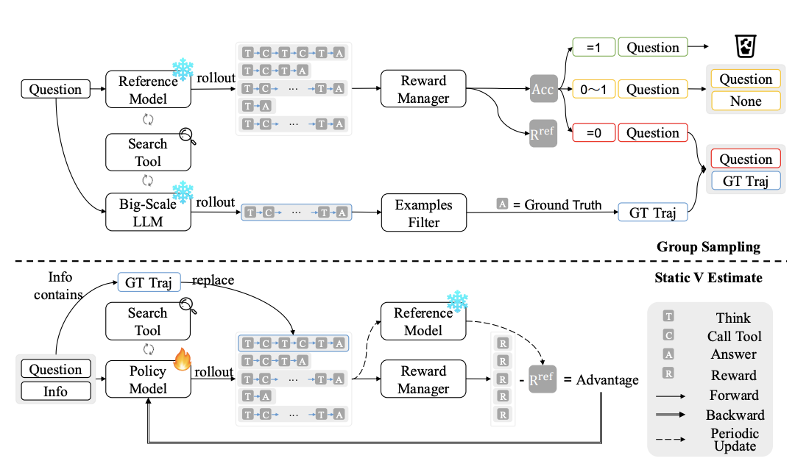

# 📘 PVPO: Pre-Estimated Value-Based Policy Optimization for Agentic Reasoning

## 1. 개요 (Overview)

* **제목**: PVPO: Pre-Estimated Value-Based Policy Optimization for Agentic Reasoning  
* **저자**: Wenfeng Feng, Penghong Zhao, Guochao Jiang, Chuzhan Hao, Yuewei Zhang, Hao Wang 
* **소속**: Alibaba Cloud Computing
* **학회**: arXiv preprint (2025-08-28 공개)  
* **링크**: [arXiv](https://arxiv.org/abs/2508.21104) / GitHub (추가 예정) / Papers with Code (추가 예정)

> **논문 선정 이유**  
> 본 논문은 LLM 기반 **Agentic Reasoning**(스스로 도구 사용, 검색, 단계적 추론)의 성능 최적화를 위한 새로운 강화학습 방법을 제안합니다.  
> 기존 critic-free 방법인 GRPO(Group Relative Policy Optimization)가 갖던 높은 계산 비용과 불안정성을 개선하기 위해, **Reference Model 기반 사전 가치 추정(Pre-estimation)**과 **데이터 Pre-sampling 전략**을 결합한 **PVPO**를 제시합니다.  
> PVPO는 critic 없이도 안정적인 advantage 추정이 가능하며, rollouts 비용을 60% 이상 줄이면서도 기존 SOTA와 동등한 성능을 달성해, 대규모 reasoning 과제에서 실질적인 활용 가능성을 보여줍니다.

---

## 2. 문제 정의 (Problem Formulation)

**문제 및 기존 한계**:

* **Agentic Reasoning** 과제(멀티스텝 검색, 수학적 추론 등)는 보상이 희박(sparse reward)하고, 긴 reasoning trajectory를 필요로 함.  
* 기존 **critic-free RL** (예: GRPO, GiGPO 등)은 그룹 내 비교를 통해 advantage를 추정하지만:  
  - 그룹 평균에 의존 → **bias 누적** 발생  
  - 충분한 rollouts 없이는 불안정 → **계산 비용 과다**  
  - 정책이 자기 행동 분포에 갇혀 **local optimum** 에 빠질 위험 존재  
* DAPO 같은 방법은 high-value 샘플을 우선적으로 쓰지만, **자원 재분배**일 뿐 **실제 계산 비용 감소**로 이어지지 않음:contentReference[oaicite:0]{index=0}.

---

**제안 방식 (PVPO)**:

* **Static V Estimate (정적 V 추정치)**  
  - 미리 준비된 **Reference Model** 을 통해 rollout을 수행 → 얻어진 평균 보상(`R_ref`)을 **고정 baseline(anchor)** 으로 사용  
  - Advantage 계산식:  
    ```math
    \hat{A}^{PVPO}(τ_i, s_0) = Q^{dyn}(τ_i) - V^{sta}(s_0)  
    = r_i - \text{mean}(r_{ref})
    ```
    → 기존의 변동성 큰 그룹 평균 baseline(`V_dyn`)을 대체하여 **안정적 학습 신호 제공**.

* **Group Sampling (그룹 샘플링 전략)**  
  - Reference Model로 각 샘플의 정답률을 사전 평가  
  - 정확도 `=1`인 trivial 샘플 제외 (학습 기여도 낮음)  
  - 정확도 `0 < acc < 1`인 샘플만 유지 (학습에 가치 있음)  
  - 정확도 `=0`인 경우: 대규모 LLM을 이용해 **Ground Truth Trajectory (GT Traj)** 생성 → sparse reward 상황에서도 긍정적 학습 신호 확보

---

> ※ **핵심 개념 정의**
> - **Advantage Function (A=Q−V)**: 특정 행동이 평균 정책 대비 얼마나 좋은지 나타내는 지표.  
> - **Static V Estimate**: 현재 policy와 무관하게 reference model 기반으로 미리 계산된 baseline. 변동성↓, 안정성↑.  
> - **Group Sampling**: 데이터셋을 filtering하여 trivial/불가능 샘플을 제거하고 high-value trajectory 중심으로 학습을 강화하는 전략.  
> - **Agentic Reasoning**: LLM이 스스로 검색, 도구 사용, multi-hop 추론을 수행하는 과정.

---

# PVPO (Policy-based Value Policy Optimization) 모델 구조

## 전체 구조


**정책 모델(πθ)**이 질문 *q*에 대해 그룹 단위로 여러 trajectory(출력 시퀀스) {o₁,…,o_G}를 생성합니다("Forward"). 생성물은 **Reward Manager**로 전달되어 보상 r를 산출합니다. 이후 중요도비 rᵢ,ₜ(θ), 클리핑, KL 패널티를 포함한 목적식으로 **역전파(Backward)**가 이루어집니다.

*도식적 개요는 Figure 1 참조: 정해진 주기마다 참조 모델이 R_ref(= Static V Estimate)를 갱신해 baseline 안정성을 유지하며, Reward Manager는 보상 생성 자체를 제한하지 않습니다.*

### 주요 구성 요소

#### 📌 Static V Estimate 모듈
**참조 모델(π_ref)**의 사전 롤아웃으로 얻은 평균 보상 R_ref를 고정 baseline(anchor)으로 제공합니다("Periodic Update"). 이 값은 현재 정책의 그룹 평균에 의존하지 않아 분산이 낮고 안정적입니다.

```
V̂_sta(s₀) = (1/M) Σⱼ₌₁ᴹ rⱼʳᵉᶠ = mean(r_ref)
```

#### 📌 Group Sampling 모듈
참조 모델로 각 샘플의 정답률을 사전 평가하여:
- **(i)** 너무 쉬운 샘플(Acc=1) 제거
- **(ii)** 학습 가치가 있는 중간 난이도(0<Acc<1) 유지  
- **(iii)** 불가능(Acc=0)에는 **GT Trajectory**를 주입해 희박 보상 환경에서도 학습 신호를 확보

이 필터링은 전체 데이터의 40–60%를 제거해 총 학습 시간을 1.7–2.5× 단축합니다.

#### 📌 PVPO 목적식
GRPO의 클립드 서러게이트와 동일한 골격에 **새로운 advantage**(Â_PVPO)와 **GT Traj 주입 시 분모 정책 교체**(π_gt) 규칙을 결합합니다.

---

## 💠 핵심 모듈 상세

### 📌 Policy Grouping & Objective (PVPO Core)

**작동 방식**  
정책은 질의 *q*마다 G개의 출력 {oᵢ}를 생성하고, 각 토큰 단계에서 중요도비 *rᵢ,ₜ(θ)* 를 통해 PPO-류의 클립드 서러게이트를 최적화합니다.

**PVPO 목적식:**
```
J_PVPO(θ) = 𝔼[1/G Σᵢ₌₁ᴳ 1/|oᵢ| Σₜ₌₁|oᵢ| {min(rᵢ,ₜ(θ)Âᵢ,ₜᴾⱽᴾᴼ, clip(rᵢ,ₜ(θ), 1-ε, 1+ε)Âᵢ,ₜᴾⱽᴾᴼ) - βD_KL[πθ || πref]}]
```

**중요도비 계산:**
- **GT Traj가 아닌 경우:**
```
rᵢ,ₜ(θ) = πθ(oᵢ,ₜ | q, oᵢ,<ₜ) / πθ_old(oᵢ,ₜ | q, oᵢ,<ₜ)
```

- **GT Traj인 경우(주입된 정답 trajectory):**
```
rᵢ,ₜ(θ) = πθ(oᵢ,ₜ | q, oᵢ,<ₜ) / πgt(oᵢ,ₜ | q, oᵢ,<ₜ)
```

### 📌 Dynamic Q Estimate (On-Policy Return)

현재 정책 πθ로부터 얻는 단일 롤아웃의 최종 보상을 그대로 행동가치의 몬테카를로 추정치로 사용:

```
Q̂_dyn(τᵢ) = 𝔼[R(τᵢ)] = rᵢ
```

### 📌 Dynamic V Estimate vs Static V Estimate

**Dynamic V Estimate (Group Mean Baseline) - 한계:**
```
V̂_dyn(s₀) = 1/N Σⱼ₌₁ᴺ rⱼ = mean(r)
Â_dyn(τᵢ, s₀) = rᵢ - mean(r)
```
- 그룹 샘플링마다 크게 요동하고 πθ에 직접 종속되어 불안정한 baseline

**Static V Estimate (Reference Anchor) - PVPO 채택:**
```
V̂_sta(s₀) = 1/M Σⱼ₌₁ᴹ rⱼʳᵉᶠ = mean(r_ref)
Â_PVPO(τᵢ, s₀) = rᵢ - mean(r_ref)
```
- 정책 변화에 비종속적이고 분산이 낮은 baseline
- 적은 롤아웃으로도 안정적 업데이트 가능

### 📌 Reward Manager (보상 정의)

포맷이 올바르면 최소 보상 0.1을 보장하고, 정답률 r_acc로 상한을 정합니다:

```
rᵢ = {
  max(0.1, r_acc), if format correct
  0,               if format incorrect
}
```

**정답률 계산:**
```
r_acc = {
  F1(a_pred, a_gt),  if L_pred ≥ n·L_gt
  CEM(a_pred, a_gt), if L_pred < n·L_gt
}
```
(n=3 default)

### 📌 Reference Model (πref) & Periodic Update

참조 모델은 주기적으로 R_ref(=mean(r_ref))를 갱신해 성능 하한과 baseline 안정성을 유지합니다. Figure 1에도 "Periodic Update"로 명시되어 있습니다. 훈련 전반에서 π_ref는 정책 변화에 무관한 외생 baseline을 제공하므로, on-policy 그룹 평균(V_dyn) 대비 분산과 바이어스가 낮습니다.

---

## 🔎 아키텍처적 특징 (요약)

### GRPO 대비 주요 차이점
- **Advantage 정의**: GRPO는 `Âᵢ,ₜ = (rᵢ - mean(r)) / std(r)` 사용
- **PVPO는 Static V Estimate**: `Âᵢ,ₜᴾⱽᴾᴼ = rᵢ - mean(r_ref)` 사용
- **중요도비 분모**: GT Traj 주입 시 π_old 대신 π_gt 사용

### 성능 효과
- 적은 롤아웃으로도 안정적 advantage 제공 → 수렴 속도↑, 총 시간↓
- 실제로 N=2(저예산)로도 GRPO(N=5)의 97% 성능(55.0% vs 56.8%)에 <40% 비용으로 도달
- 정적 baseline + 데이터 필터링의 결합이 핵심: Static V Estimate가 저분산 기준선을 제공하고, Group Sampling이 유효 그라디언트 밀도를 높여 클립드 서러게이트의 업데이트 방향성이 선명해짐

### 데이터 효율성
- Group Sampling을 통한 필터링으로 40-60% 데이터 제거
- 1.7-2.5× 학습 속도 향상
- 성능 저하 없이 효율성 개선

---

## ⚖️ 기존 모델과의 비교

| 항목    | 본 논문 (PVPO) | 기존 방법1 (GRPO) | 기존 방법2 (PPO) |
| ----- | -------------- | ----------------- | ---------------- |
| 구조    | Critic-free + Static V Estimate + Group Sampling | Critic-free, 그룹 내 상대 비교 | Actor-Critic (critic 네트워크 포함) |
| 학습 방식 | Reference Model로 고정 baseline 사전 계산, 고품질 샘플 필터링, GT Traj 주입 | 그룹 평균 보상 기반 advantage 계산, 많은 rollouts 필요 | Critic 네트워크로 V(s) 예측, GAE로 advantage 추정 |
| 목적    | 안정적·저분산 advantage로 효율적 학습, sparse reward 대응 | critic 제거 통한 효율성, 그러나 불안정성과 local optimum 문제 | 이론적 안정성 확보, 그러나 리소스 비용 큼 |

---

## 📉 실험 및 결과

* **데이터셋**:
  - 멀티스텝 검색: Musique, 2WikiMultiHopQA, HotpotQA, Bamboogle  
  - 수학적 추론: DAPO-Math-17k-Processed (train), AIME-2024/2025, MATH500, AMC23, Olympiad  

* **비교 모델**:
  - Prompt 기반: Qwen2.5-7B, DeepSeek-R1, O4-mini, GPT-4.1, Gemini-2.5-pro  
  - 학습 기반: GRPO, ReSearch, DynaSearcher  

* **주요 성능 지표 및 결과**:

| 모델              | Accuracy | 기타 (LasJ 등) |
| ----------------- | -------- | -------------- |
| **PVPO (7B)**     | 멀티스텝 QA 평균 61.0% | 평균 LasJ 69.55% |
| **GRPO (7B)**     | 멀티스텝 QA 평균 56.8% | 평균 LasJ 63.96% |
| Prompt LLMs (SOTA)| 평균 46–55% | LasJ 55–65% |

> **실험 결과 요약**:  
> PVPO는 동일 모델 크기(7B)에서 GRPO 대비 약 **+5%p 정확도 향상**, 계산량은 **40% 이하**로 절감.  
> 수학적 추론에서도 GRPO보다 평균 1.5–2%p 높음. 특히 rollouts=2의 저예산 설정에서도 GRPO(N=5)의 97% 성능을 달성하며 **3배 가까운 효율성**을 입증함.

---

## ✅ 장점 및 한계

## **장점**:
* Critic 없이도 안정적인 advantage 추정 → variance 낮음  
* Sparse reward 환경에서도 robust (GT Traj 주입 전략)  
* Group Sampling으로 데이터셋 효율적 축소 → 학습 속도 1.7–2.5× 개선  
* GRPO 대비 적은 rollouts로 동등 이상 성능 달성  

## **한계 및 개선 가능성**:
* Reference Model 품질에 의존 → baseline이 부정확할 경우 성능 저하  
* GT Traj 생성을 위해 별도의 대규모 LLM 필요 (추가 비용)  
* 오픈도메인 복잡 과제(예: 도구 연계 멀티모달 reasoning)로 확장 실험 부족  

---

## 🧠 TL;DR – 한눈에 요약

> **PVPO는 Static V Estimate와 Group Sampling을 결합해, critic-free RL에서 안정성과 효율성을 동시에 달성한 방법론.**  
> 적은 rollouts로도 GRPO 이상의 성능을 내며, Agentic Reasoning 과제에서 SOTA를 달성함.

| 구성 요소  | 설명 |
| ------ | -- |
| 핵심 모듈  | Static V Estimate (Reference Anchor), Group Sampling |
| 학습 전략  | Critic-free, Advantage = Dynamic Q − Static V |
| 전이 방식  | GT Traj 주입으로 sparse reward 보완 |
| 성능/효율성 | GRPO 대비 +5% 성능, 계산량 40% 이하 |

---

## 🔗 참고 링크 (References)

* [📄 arXiv 논문](https://arxiv.org/abs/2508.21104)
* [💻 GitHub](https://github.com/) (추후 공개 여부 확인 필요)
* [📈 Papers with Code](https://paperswithcode.com/) (등록 시 추가 예정)

---


  
