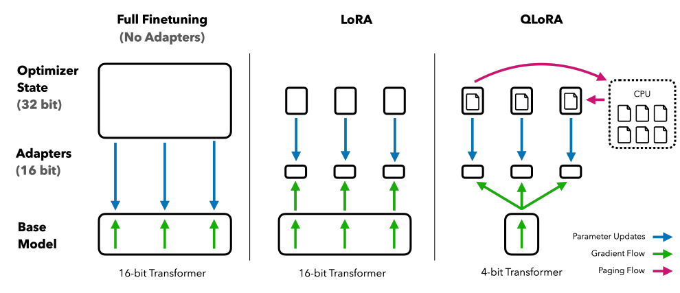

# 📘 QLoRA: Efficient Finetuning of Quantized LLMs

## 1. 개요 (Overview)

- **제목**: QLoRA: Efficient Finetuning of Quantized LLMs  
- **저자**: Tim Dettmers, Artidoro Pagnoni, Ari Holtzman, Luke Zettlemoyer  
- **소속**: University of Washington, Meta AI  
- **학회**: ACL 2023 (Association for Computational Linguistics)  
- **링크**:  
  - [arXiv](https://arxiv.org/abs/2305.14314)  
  - [GitHub](https://github.com/artidoro/qlora)  
  - [Papers with Code](https://paperswithcode.com/paper/qlora-efficient-finetuning-of-quantized)

> 이 논문은 **LoRA 기반 파인튜닝 기법을 더욱 저렴하게 만들기 위한 확장 방식**으로,  
> 대규모 언어 모델을 **4-bit로 양자화(quantization)** 한 후에도 **정밀도를 유지한 채 미세조정(finetuning)** 할 수 있는 혁신적인 방법을 제안한다.  
> 특히, QLoRA는 **단일 GPU에서도 LLaMA-65B 같은 초대형 모델을 fine-tune 가능하게 만든 최초의 방식** 중 하나로,  
> 연구/산업 양쪽에서 **PEFT + 양자화 기반 학습의 실용성**을 입증했다.

---

## 2. 문제 정의 (Problem Formulation)

---

### ❗ 문제 및 기존 한계

- 기존 LoRA는 **효율적인 파인튜닝**을 가능하게 했지만,  
  여전히 **full-precision (16bit 또는 32bit) 모델을 메모리에 올려야만** 작동한다.

- GPT, LLaMA 등 **수십억 파라미터 모델을 미세조정하려면**  
  **A100과 같은 고성능 GPU 수십 장**이 필요하여 일반 연구 환경에서는 실행이 어렵다.

- 기존 8bit/4bit 양자화된 모델은 **정밀도 손실로 학습이 어려웠고**,  
  파인튜닝 시 **오류 누적 및 성능 저하**가 빈번하게 발생하였다.

---

### 💡 제안 방식: QLoRA

- QLoRA는 **모델 전체를 4bit로 양자화**하여 GPU 메모리 사용량을 급감시키면서도,  
  기존 LoRA와 유사한 방식으로 **정확도 손실 없이 파인튜닝 가능**하게 한다.

- 핵심 구성:
  - **4-bit Quantization (NF4)**: 정밀도와 압축률 사이에서 최적 성능 제공
  - **Double Quantization**: weight 자체를 양자화한 후, 양자화 파라미터도 다시 양자화
  - **LoRA 적용**: 양자화된 모델에 저랭크 학습 모듈만 추가로 학습

> 결과적으로 QLoRA는 **65B LLM조차 단일 A100 GPU에서 학습 가능**하게 만든 경량화 PEFT 전략이다.

---

### 📌 핵심 개념 정의

- **Quantization (양자화)**: 모델 파라미터의 표현 정밀도를 줄여 (예: float16 → int4),  
  메모리 사용량과 연산량을 감소시키는 기술

- **NF4 (Normalized Float 4-bit)**: QLoRA에서 사용된 **정보 손실을 최소화한 4bit 부동소수 표현 방식**

- **Double Quantization**: weight를 양자화한 후,  
  양자화 시 사용된 **scaling factor** 자체도 다시 양자화해 추가 압축을 달성

- **LoRA**: 기존 파라미터는 고정하고, 저랭크 행렬(ΔW = BA)만 학습하는 경량 파인튜닝 방법

---

## 3. 모델 구조 (Architecture)

---

### 🧱 전체 구조



QLoRA는 다음 세 가지 핵심 모듈이 결합된 구조입니다:

1. **4-bit 양자화된 언어모델** (정확도 손실 최소화)
2. **LoRA 모듈** (저랭크 파라미터 학습)
3. **Double Quantization** (메모리 효율 향상)

모델의 전체 흐름은 다음과 같습니다:
```
[Input Text Tokens]
↓
[Tokenizer → Embedding]
↓
[4-bit Quantized Transformer (NF4)]
├── (LoRA module 삽입된 Linear Layer)
↓
[Output Hidden States]
↓
[Loss 계산 + Gradient는 LoRA에만 적용]
```

> 🔧 기존 LoRA는 full precision weight 위에 LoRA를 얹었다면,  
> **QLoRA는 quantized weight 위에 LoRA를 적용**한다는 점이 구조적 핵심 차이입니다.

> 📌 LoRA + 양자화가 완전히 분리되지 않고 **하나의 훈련 가능한 경량 모듈로 통합**되어 작동합니다.

---

### 💠 핵심 모듈 또는 구성 요소

#### 📌 1. 4-bit Quantized Language Model (NF4)

- **작동 방식**: 모든 weight를 **NF4 (Normalized Float 4-bit)** 형식으로 양자화
- **NF4 특징**:
  - 균등 quantization이 아닌 **분포 기반 비선형 스케일링** 사용
  - 기존 int4보다 훨씬 높은 표현력 확보
  - 학습 시 정밀도 손실을 최소화함

- **구조적 개념**:

  기존 float16 weight $W$를 다음과 같이 변환:\
  $W \rightarrow \hat{W} = \text{Dequant}(Q(W), s)$\
  여기서 $Q(W)$는 NF4로 양자화된 벡터, $s$는 scale factor

- **LoRA와의 차이점**:  
  LoRA는 **full-precision 모델 위에서만 작동 가능**했지만,  
  QLoRA는 **4-bit weight 위에서 LoRA 적용을 가능**하게 함

---

#### 📌 2. LoRA Module

- 기존과 동일하게, 특정 Linear 계층에 대해\
  $W' = \hat{W} + \Delta W = \hat{W} + BA$\
  의 형태로 파라미터를 학습

- 학습 대상은 $A, B$ 두 저랭크 행렬뿐이며, $\hat{W}$는 4-bit 양자화된 채로 **동결(frozen)**됨

- **차이점 요약**:
  | 항목           | LoRA                        | QLoRA                                 |
  |----------------|-----------------------------|----------------------------------------|
  | 기반 모델      | Full-precision Transformer  | 4-bit Quantized Transformer (NF4)     |
  | 메모리 사용량   | 큼                          | 대폭 절감 (최대 3× 이상)              |
  | 연산 방식      | float16 or float32          | quantized weight + LoRA float         |

---

#### 📌 3. Double Quantization

- **작동 방식**: 양자화 weight를 저장할 때 사용되는 **scale factor 자체도 다시 양자화**
- 이는 weight의 정보를 저장하는 데 필요한 메모리를 **추가로 2× 감소**시킴

- **개념 요약**:
  1. 원본 weight $W$ → 4-bit NF4 벡터 $Q(W)$ + scale factor $s$
  2. scale factor $s$도 양자화되어 저장: $Q(s)$

- **이점**:
  - 학습에는 영향 없음 (scale factor는 저장용)
  - 모델 checkpoint 용량이 훨씬 작아짐

---

### 🔍 LoRA vs QLoRA 구조적 비교 요약

| 항목                        | LoRA                          | QLoRA                                      |
|-----------------------------|-------------------------------|---------------------------------------------|
| 모델 기반                   | Full-precision (FP16/FP32)     | 4-bit Quantized (NF4)                      |
| 연산/메모리 효율             | 제한적                        | 매우 효율적 (단일 GPU로 65B 모델 학습 가능) |
| 학습 파라미터               | A, B                          | A, B (동일)                                 |
| 파인튜닝 가능성             | 고성능 GPU 필요                | 단일 A100도 가능                            |
| 응용 확장성                | NLP 중심                      | NLP + 대규모 LLM (LLaMA-13B, 65B 등)        |

---

### 🔄 요약

QLoRA는 기존 LoRA와 동일한 저랭크 파라미터 학습 전략을 유지하면서도,  
**전체 모델을 4-bit로 양자화하여 메모리 효율을 획기적으로 향상**시킨 구조를 가진다.  
LoRA가 full-precision weight를 기반으로 작동했다면, QLoRA는 **양자화 weight 위에서 직접 작동**할 수 있게 만드는 것이 핵심 차별점이다.

---
## ✅ 장점 및 한계

---

## 🌟 **장점**:

- ✅ **메모리 효율 극대화**  
  → 기존 LoRA보다 훨씬 더 작은 메모리로 학습 가능  
  → 예: LLaMA 65B 모델도 **단일 48GB GPU(A100)** 에서 학습 가능

- ✅ **4bit Quantization에도 성능 유지**  
  → NF4 양자화 덕분에 4bit에서도 Full Precision과 거의 동일한 정확도 달성  
  → 예: GPT-3 175B 모델과 유사한 성능을 Vicuna 13B로 복제 가능

- ✅ **LoRA 호환성 유지**  
  → 기존 LoRA 방식 그대로 사용 가능 (LoRA의 모든 이점 유지)  
  → 기존 학습 인프라 및 코드와 호환됨

- ✅ **Checkpoints 저장 용량 감소**  
  → Double Quantization 덕분에 모델 저장 공간도 줄어듦  
  → 양자화된 weight와 스케일 파라미터도 모두 압축됨

- ✅ **실제 오픈소스 커뮤니티에서 광범위하게 사용 중**  
  → Vicuna, Guanaco 등 유명 모델이 모두 QLoRA로 파인튜닝됨

---

## ⚠️ **한계 및 개선 가능성**:

- ❌ **4bit 연산은 일부 GPU/프레임워크에서 미지원**  
  → NF4는 **BitsAndBytes**와 같은 특수 라이브러리에 의존  
  → CPU 또는 일부 GPU에서는 속도 저하나 지원 부족 가능성

- ❌ **LoRA 위치 선정은 여전히 수동**  
  → 어떤 Layer에 LoRA를 삽입할지 결정하는 것은 여전히 실험적으로 설정해야 함

- ❌ **양자화된 weight는 미세 조정 불가능**  
  → 오직 LoRA 모듈만 학습 가능하므로 전체 weight 조정은 불가

- ❌ **멀티모달/비전 등 확장성은 검증 부족**  
  → NLP에서는 검증되었지만, 비전/멀티모달 모델에는 적용 연구가 적음

---

> 📌 **요약**: QLoRA는 LoRA의 파라미터 효율성과 4bit 양자화의 메모리 절감을 결합한  
> 매우 실용적인 PEFT 기법이지만, 여전히 일부 제약을 안고 있으며 후속 연구로 확장되고 있음.

---

## 🧠 TL;DR – 한눈에 요약

> **QLoRA는 대규모 언어 모델의 전체 weight를 4bit로 양자화하면서도,  
> LoRA를 통해 정밀한 파인튜닝을 가능하게 만든 초경량 PEFT 기법이다.**  
> 이를 통해 단일 GPU에서도 LLaMA-65B와 같은 초거대 모델의 미세조정이 가능해졌으며,  
> 메모리 효율성과 성능 모두를 극대화한 파인튜닝 접근법을 제시한다.

---

| 구성 요소      | 설명 |
|----------------|------|
| **핵심 모듈**    | NF4 4-bit Quantized Transformer + LoRA 모듈 + Double Quantization |
| **학습 전략**    | Quantized weight는 동결, LoRA 행렬 (A, B)만 학습, scale factor도 양자화 |
| **전이 방식**    | Base LLM은 그대로 재사용, task-specific LoRA 모듈만 별도로 파인튜닝 |
| **성능/효율성** | 기존 LoRA 대비 GPU 메모리 사용량 3배 절감, Full-precision 성능 거의 유지 |

---

## 🔗 참고 링크 (References)

* [📄 arXiv 논문](https://arxiv.org/abs/2305.14314)
* [💻 GitHub](https://github.com/artidoro/qlora)
* [📈 Papers with Code](https://paperswithcode.com/paper/qlora-efficient-finetuning-of-quantized)

---


