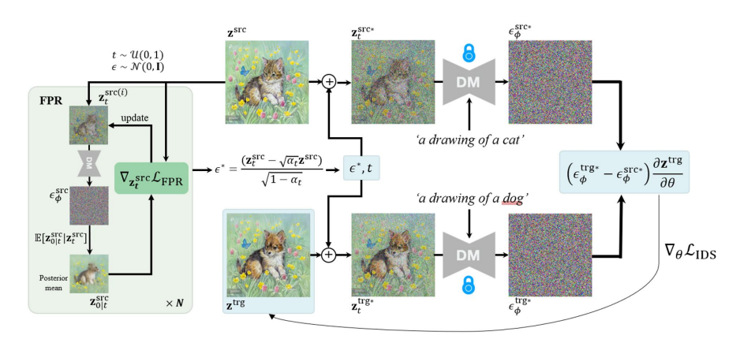

# 📘 Identity-preserving Distillation Sampling by Fixed-Point Iterator

## 1. 개요 (Overview)

* **제목**: Identity-preserving Distillation Sampling by Fixed-Point Iterator  
* **저자**: SeonHwa Kim, Jiwon Kim, Soobin Park, Donghoon Ahn, Jiwon Kang, Seungryong Kim, Kyong Hwan Jin, Eunju Cha  
* **소속**: Korea University, Sookmyung Women’s University, KAIST  
* **학회**: arXiv preprint (2025)  
* **링크**: [arXiv](https://arxiv.org/abs/2502.19930) / [GitHub](https://github.com/shhh0620/IDS) / [Papers with Code](https://paperswithcode.com/paper/identity-preserving-distillation-sampling-by)  

> 본 논문은 **Score Distillation Sampling (SDS)** 기반 이미지/3D 객체 생성에서 발생하는 **정체성(identity) 손실 문제**를 해결하기 위해 제안.  
> 기존 SDS/DDS 방식은 텍스트 조건부 스코어에 의해 원본 이미지의 구조와 포즈가 쉽게 왜곡되는 한계.  
> 저자들은 이를 극복하기 위해 **Fixed-point Regularization(FPR)**을 도입, 스코어를 자기보정(self-correction) 방식으로 수정하여  
> **원본 정체성을 보존하면서도 텍스트 조건부 편집을 가능하게 하는 IDS(Identity-preserving Distillation Sampling)** 기법을 제안.  
> 이 연구는 **텍스트 기반 이미지 편집과 NeRF 기반 3D 편집** 모두에서 구조적 일관성을 유지하며 최신 기법 대비 우수한 성능을 보여,  
> 향후 **정체성 보존이 중요한 이미지 생성·편집 분야**에서 핵심적인 기여를 할 수 있을 것으로 기대.  

---

## 2. 문제 정의 (Problem Formulation)

**문제 및 기존 한계**:

* **SDS (Score Distillation Sampling)**  
  - 텍스트 조건부 스코어를 이용해 이미지·3D 객체를 생성할 수 있지만,  
    *노이즈가 많은 그라디언트* 때문에 결과물이 **블러리**하거나 **정체성(Identity)이 손상**되는 문제가 발생.  
  - 동일한 텍스트 프롬프트라도 다양한 구조나 배경으로 매핑될 수 있어 원본의 **구조·포즈 보존 실패**.  

* **DDS (Delta Denoising Score)**  
  - SDS의 문제를 보완하기 위해 소스-타깃 쌍의 차이(Δ score)를 활용.  
  - 그러나 여전히 텍스트 조건부 스코어의 **오차 누적**으로 인해 원본의 **정체성을 완전히 보존하지 못함**.  
  - 특히 고양이→돼지 같은 구조 변화가 큰 편집 시, 포즈나 배경이 손상됨.  

---

**제안 방식 (IDS: Identity-preserving Distillation Sampling)**:

* **Fixed-point Regularization (FPR)**  
  - 텍스트 조건부 스코어가 원본 이미지와 어긋나는 문제를 **posterior mean (Tweedie’s formula)** 기반 자기보정(self-correction)으로 해결.  
  - 원본 이미지와 posterior mean 간의 차이를 최소화하는 방식으로 latent를 반복적으로 업데이트 → **Identity-consistent gradient** 확보.  

* **Guided Noise (ϵ\*) 활용**  
  - 보정된 latent에서 추출한 **Guided Noise**를 사용하여 타깃 이미지로 업데이트.  
  - 기존 무작위 노이즈와 달리 **원본의 정체성을 반영한 방향성 있는 편집** 가능.  

---

> ※ **핵심 개념 정의**  
> - **SDS (Score Distillation Sampling)**: 사전 학습된 Diffusion 모델의 스코어를 활용해 텍스트 기반 2D/3D 생성을 수행하는 방법.  
> - **DDS (Delta Denoising Score)**: 소스-타깃 프롬프트 차이를 이용해 SDS의 노이즈 문제를 완화한 방법.  
> - **FPR (Fixed-point Regularization)**: posterior mean과 원본 이미지 간 차이를 최소화하여 스코어를 원본에 정렬(alignment)시키는 반복 보정 기법.  
> - **Guided Noise (ϵ\*)**: FPR을 통해 얻어진 보정된 노이즈로, 정체성을 유지하며 편집을 유도.  

---

# 모델 구조 (Architecture)

## 전체 구조

- **백본**: 사전학습된 텍스트-이미지 확률적 확산모델 $\epsilon_\phi$과 **CFG**(Classifier-Free Guidance)를 사용해 시점 $t$에서의 점수(노이즈 예측)를 얻음. 소스 쌍 $\{z_{\mathrm{src}}, y_{\mathrm{src}}\}$와 타깃 프롬프트 $y_{\mathrm{trg}}$가 주어질 때, 편집 목표 $z_{\mathrm{trg}}$를 최적화.

- **SDS/DDS 블록**: 기존 SDS 손실 $\nabla L_{\mathrm{SDS}}$ 및 DDS 손실 $\nabla L_{\mathrm{DDS}}$를 기반으로, 텍스트 조건 점수의 차이를 이용해 타깃으로의 업데이트 방향을 계산. 단, DDS만으로는 소스 정체성(구조·포즈) 보존이 불완전.

- **FPR(고정점 정규화) 루프**: Tweedie 공식을 이용해 후단기댓값(Posterior mean)을 계산하고, 이를 소스 이미지에 가깝게 만드는 **자기보정 루프**로 소스 정체성에 맞춘 신뢰도 높은 점수를 획득.

- **Guided Noise 추출 및 IDS 업데이트**: FPR로 정렬된 소스 잠복표현에서 **유도 노이즈 $\epsilon^*$**를 추출해, 무작위 노이즈 대신 이를 사용하여 타깃 업데이트 방향을 계산하는 **IDS 손실**로 최적화. 결과적으로 소스의 정체성을 유지한 채 편집.

### 입력→출력 흐름(요약)
$\{z_{\mathrm{src}}, y_{\mathrm{src}}\}$ → 전방 확산으로 $z_{\mathrm{src},t}$ → FPR 반복으로 점수 정렬 및 $z_{\mathrm{src},t}^*$ 획득 → $\epsilon^*$ 추출 → $\{z_{\mathrm{trg}}, y_{\mathrm{trg}}\}$에 $\epsilon^*$ 적용 → $\nabla L_{\mathrm{IDS}}$로 $z_{\mathrm{trg}}$ 업데이트 → 편집 결과 $z_{\mathrm{trg}}^{\mathrm{final}}$

---

## 핵심 모듈 및 구성 요소

### 1. Diffusion 백본 & CFG

**작동 방식**
확산모델은 시점 $t$에서의 노이즈 예측기를 학습:

$$\mathcal{L}(\phi)=\mathbb{E}_{t,\epsilon}\left[\left\|\epsilon_\phi(z_t, y, t)-\epsilon\right\|_2^2\right], \quad z_t=\sqrt{\alpha_t}\,z_0+\sqrt{1-\alpha_t}\,\epsilon$$

CFG로 조건/비조건 점수를 선형 결합:

$$\epsilon_\phi^\omega(z_t, y, t) = (1+\omega)\epsilon_\phi(z_t, y, t) - \omega\epsilon_\phi(z_t, \emptyset, t)$$

**구조적 개념**
$\epsilon_\phi^\omega$는 $z_t$를 프롬프트 $y$에 부합하는 표본으로 되돌리는 방향을 주며, 이후 모든 손실(SDS/DDS/IDS)의 기본 구성요소가 됨.

### 2. SDS / DDS 그라디언트 모듈

**SDS(Score Distillation Sampling)**
미분가능한 생성자(또는 장면 파라미터) $\theta$에 대해:

$$\nabla_\theta L_{SDS}(z, y) = E_{t,\epsilon}[\omega(t)(\epsilon_\phi^\omega(z_t, y, t) - \epsilon)\frac{\partial z}{\partial \theta}]$$

하나의 텍스트가 여러 구조/배경에 대응할 수 있어 블러/정체성 손상이 발생.

**DDS(Delta Denoising Score)**
소스/타깃 점수 차로 텍스트 비정렬 성분을 제거:

$$\nabla_\theta L_{DDS} = E_{t,\epsilon}[(\epsilon_\phi^\omega(z_t^{trg}, y^{trg}, t) - \epsilon_\phi^\omega(z_t^{src}, y^{src}, t))\frac{\partial z^{trg}}{\partial \theta}]$$

그러나 텍스트-조건 점수의 잔여 오차가 누적되어 구조/포즈 변형이 남음.

**문제점**
$\epsilon_\phi^\omega(z_t^{src}, y^{src}, t)$가 정확히 소스를 가리키지 않을 수 있음 → 누적 오차로 정체성 붕괴. 시간범위 제한만으로는 불충분.

### 3. FPR (Fixed-point Iterative Regularization)

**역할**
텍스트-조건 점수를 소스 정체성에 정렬시키는 자기보정 루프. 핵심은 **후단기댓값(Posterior mean)**을 Tweedie 공식으로 계산해 그것이 소스 이미지와 유사하도록 $z_t^{src}$를 반복 업데이트하는 것.

**수식**
Posterior mean:
$$z_{0|t}^{src} = \frac{1}{\sqrt{\alpha_t}}(z_t^{src} - \sqrt{1-\alpha_t}\epsilon_\phi^{src})$$

FPR 손실(유클리드 거리 사용):
$$L_{FPR} = d(z^{src}, z_{0|t}^{src}), \quad z_t^{src} \leftarrow z_t^{src} - \lambda\nabla_{z_t^{src}}L_{FPR}$$

반복 횟수 $N$, 스케일 $\lambda$로 조절.

**구조적 개념**
점수를 바꾸는 두 방법(주입 노이즈 $\epsilon$ 변경 vs. 잠복 $z_t^{src}$ 갱신) 중, 잠복 갱신이 내용 보존에 유리하여 이를 채택.

### 4. Guided Noise 추출기

**작동 방식**
FPR로 정렬된 $z_t^{src*}$에서 유도 노이즈 $\epsilon^*$를 추출:

$$\epsilon^* = \frac{1}{\sqrt{1-\alpha_t}}(z_t^{src*} - \sqrt{\alpha_t}z^{src})$$

이는 무작위 $\epsilon$ 대신, 소스 정체성을 내재한 방향벡터로 사용됨.

**역할 및 기존과 차별점**
기존 DDS는 랜덤 $\epsilon$에 의존하여 누적 편향이 남지만, IDS는 $\epsilon^*$로 업데이트를 유도해 완전 복원성 및 정체성 보존을 강화.

### 5. IDS 업데이트 규칙

**손실 정의**
유도 노이즈를 반영한 IDS 손실:

$$\nabla_\theta L_{IDS} = E_{t,\epsilon}[(\epsilon_\phi^\omega(z_t^{trg*}, y^{trg}, t) - \epsilon_\phi^\omega(z_t^{src*}, y^{src}, t))\frac{\partial z^{trg}}{\partial \theta}]$$

여기서 $z_t^{trg*}$는 $\epsilon^*$로부터 생성된 타깃 잠복.

**효과**
텍스트 정렬에 충실하면서도 소스 구조/포즈(아이덴티티)를 유지. DDS 대비 역변환 실험에서 완전 복원에 근접.

### 6. NeRF 확장 (선택사항)

**개념**
동일한 IDS 규칙을 NeRF 파라미터 최적화로 확장해 3D 편집 시에도 구조적 일관성 유지. 정량/정성 평가에서 DDS/CDS 대비 우수.

---
## ⚖️ 기존 모델과의 비교

| 항목    | 본 논문 (IDS) | 기존 방법1 (SDS) | 기존 방법2 (DDS) |
| ----- | ------------- | ---------------- | ---------------- |
| 구조    | FPR(Fixed-point Regularization) 기반 self-correction + Guided Noise | 사전학습된 Diffusion score 기반 단순 최적화 | SDS gradient에서 source-target 차이(Δ score) 활용 |
| 학습 방식 | Posterior mean(Tweedie’s formula) 기반 iterative regularization | 텍스트 조건 점수 직접 사용 | 소스-타깃 점수 차이를 통해 업데이트 |
| 목적    | 원본 정체성(구조·포즈) 보존 + 텍스트 조건부 편집/생성 | 텍스트 조건부 2D/3D 생성 | 블러 감소 및 구조 보존 일부 개선 |

---

## 📉 실험 및 결과

* **데이터셋**:
  - LAION 5B Cat-to-Others  
  - InstructPix2Pix (IP2P)  
  - Synthetic NeRF, LLFF  

* **비교 모델**:
  - P2P (Prompt-to-Prompt)  
  - PnP (Plug-and-Play)  
  - DDS (Delta Denoising Score)  
  - CDS (Contrastive Denoising Score)  

* **주요 성능 지표 및 결과**:

| 모델      | IoU (↑) | PSNR (↑) | LPIPS (↓) | CLIP (↑) | 기타 |
| ------- | ------- | -------- | -------- | ------- | ---- |
| P2P     | 0.58    | 20.88    | 0.47     | -       | 구조 손실 많음 |
| PnP     | 0.55    | 23.81    | 0.39     | -       | 객체 인식 오류 |
| DDS     | 0.69    | 26.02    | 0.24     | 0.1596  | 일부 정체성 손실 |
| CDS     | 0.72    | 27.35    | 0.21     | 0.1597  | 텍스트 의존적 |
| **IDS (Ours)** | **0.74** | **29.25** | **0.19** | **0.1626** | 정체성 보존 + 고품질 |

> **실험 결과 해석**  
> IDS는 모든 데이터셋에서 **정체성 보존 성능(IoU, LPIPS)**이 가장 뛰어났으며,  
> NeRF 편집에서도 구조적 일관성과 깊이 맵 품질을 유지하는 데 성공.  
> 다만 CLIP 점수는 target prompt alignment에서 약간 낮은 성능을 보였음.  

---

## ✅ 장점 및 한계

## **장점**:
* FPR을 통한 **self-correction**으로 누적 오차 제거 → 정체성(구조·포즈) 보존 강화  
* Guided Noise를 활용하여 **랜덤성 감소** 및 안정적 업데이트  
* 2D 이미지 편집과 3D NeRF 편집 모두에서 **SOTA 수준 성능**  
* 사용자 연구와 GPT 기반 평가에서 높은 선호도 획득  

## **한계 및 개선 가능성**:
* CLIP 점수는 상대적으로 낮음 → target prompt alignment 개선 필요  
* 복잡한 프롬프트(멀티 오브젝트, 장면 변화)에선 실패 사례 발생  
* FPR 반복으로 인해 **계산 비용 증가**  
* 향후 연구: target-conditioned FPR 확장, 효율적 정규화 방법 도입  

---

## 🧠 TL;DR – 한눈에 요약

> **IDS는 Fixed-point Regularization을 통해 SDS/DDS의 noisy gradient 문제를 해결하여, 원본 정체성을 보존하면서도 텍스트 기반 편집을 안정적으로 수행하는 기법이다.**

| 구성 요소  | 설명 |
| ------ | -- |
| 핵심 모듈  | Fixed-point Regularization (FPR), Guided Noise (ϵ\*) |
| 학습 전략  | Posterior mean 기반 iterative self-correction |
| 전이 방식  | SDS/DDS 프레임워크 확장 → 이미지/NeRF 편집 |
| 성능/효율성 | 정체성 보존 성능 최고 (IoU, LPIPS), 다만 계산 비용 증가 |

---

## 🔗 참고 링크 (References)

* [📄 arXiv 논문](https://arxiv.org/abs/2502.19930)  
* [💻 GitHub](https://github.com/shhh0620/IDS)  
* [📈 Papers with Code](https://paperswithcode.com/paper/identity-preserving-distillation-sampling-by)  

---

