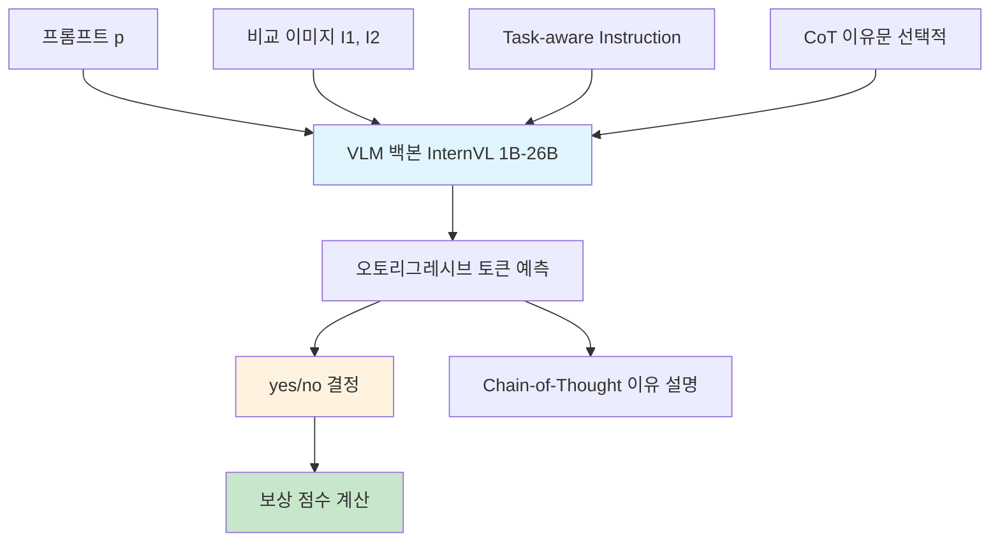
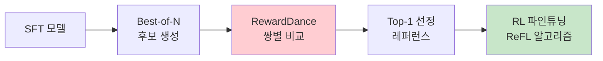
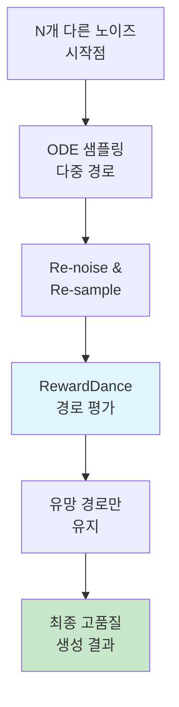
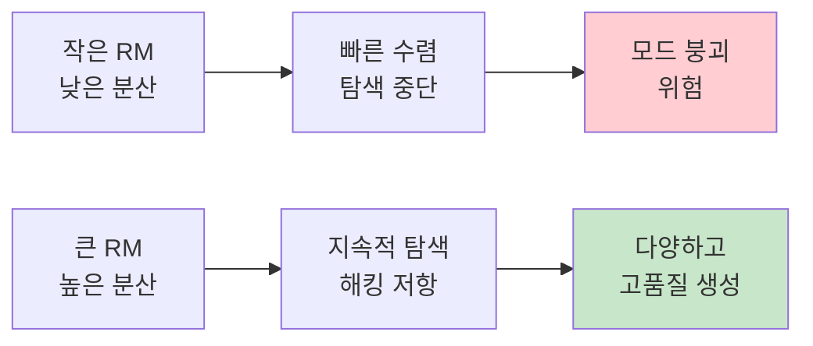

# 📘 RewardDance: Reward Scaling in Visual Generation

## 1. 개요 (Overview)

* **제목**: RewardDance: Reward Scaling in Visual Generation  
* **저자**: Yingjie Li, Boxiao Jiang, Bowen Dong, Hao Wang, Lei Zhang  
* **소속**: The Hong Kong Polytechnic University, Tencent AI Lab  
* **학회**: arXiv (2025.09, preprint)  
* **링크**: [arXiv](https://arxiv.org/abs/2509.08826)

> 이 논문은 텍스트-투-이미지/비디오 등 시각 생성에서 활용되는 **보상 모델(Reward Model)**을 더 확장 가능하고 안정적인 방식으로 설계하는 방법을 제안.  
> 기존 CLIP 기반 보상이나 Bradley-Terry 손실 방식은 확장성과 안정성에 한계가 있었는데, 본 연구는 **RewardDance**라는 새로운 프레임워크를 통해 보상을 단순한 "yes/no 토큰 예측 확률"로 정의함으로써 VLM 구조와 자연스럽게 결합시키고, 보상 해킹(reward hacking)과 모드 붕괴를 완화하는 데 초점을 둔다.  


---
## 2. 문제 정의 (Problem Formulation)

**문제 및 기존 한계**:

* 시각 생성(텍스트-투-이미지/비디오) 모델의 성능 향상을 위해 **보상 모델(Reward Model, RM)**이 사용되지만,  
  기존 접근은 확장성(scalability)과 안정성(stability)에 한계가 있음.  
* **CLIP 기반 보상**: CLIP similarity에 의존 → 단일 스코어로는 복잡한 품질·정합성·선호도를 충분히 반영하지 못함.  
* **Bradley-Terry 손실 기반 RM**: 비교(pairwise preference)에 의존 → 데이터 수집 비용이 크고, 모델 규모 확장에 취약하며,  
  보상 해킹(reward hacking)과 모드 붕괴(mode collapse) 문제가 발생.  

---

**제안 방식 (RewardDance)**:

* 보상을 “모델이 **‘yes’ 토큰을 올바르게 예측할 확률**”로 정의.  
  → 텍스트 생성과 동일한 언어 모델링 방식으로 보상 예측 가능.  
* 보상 모델을 **VLM(Visual-Language Model)** 구조와 결합시켜,  
  컨텍스트 확장(CoT reasoning, task-specific instruction, reference examples)과  
  파라미터 스케일업(수십억 단위) 모두 지원.  
* 이를 통해 **높은 보상 분산 유지**, 보상 해킹 완화, 모드 붕괴 방지.  

---

> ※ **핵심 개념 정의**  
> - **Reward Model (RM)**: 생성된 결과물의 품질을 평가하고 학습에 피드백을 주는 모델.  
> - **Reward Hacking**: 모델이 실제 품질 향상 없이 보상 신호만 높이는 현상.  
> - **Mode Collapse**: 다양한 출력을 생성하지 못하고 일부 패턴에만 수렴하는 문제.  

---

# RewardDance: 스케일러블 비주얼 보상 모델링 프레임워크

## 1. 개요

RewardDance는 비주얼 생성 모델의 성능을 획기적으로 향상시키는 스케일러블 보상 모델링 프레임워크. 기존 CLIP 기반 또는 회귀 헤드를 사용하는 VLM 기반 보상 모델들의 한계를 극복하고, **생성적 보상 패러다임(Generative Reward Paradigm)**을 통해 모델 및 컨텍스트 스케일링을 동시에 달성.


## 2. 전체 구조 (Architecture Overview)


### 🎯 핵심 설계 철학
- **스케일러빌리티**: 1B부터 26B 파라미터까지 체계적 스케일링
- **생성적 패러다임**: 보상을 "yes" 토큰 확률로 정의하여 VLM의 자기회귀적 특성과 완벽 정합
- **컨텍스트 확장**: Task-aware Instruction + Reference Examples + Chain-of-Thought

### 📊 입력 → 보상 산출 파이프라인


**수식적 정의:**
```math
r_θ = P_θ("yes" | I₁, I₂, p, τ)
```

이로써 보상 예측을 VLM의 **다음 토큰 예측** 메커니즘과 **자연스럽게 정합**.

## 3. 핵심 모듈 및 구성 요소

### 🔧 입력 포매터 & 컨텍스트 스케일러

#### **작동 방식**
- **비교 판단 태스크**: 두 이미지 중 어느 것이 더 우수한지 "yes/no"로 응답
- **컨텍스트 확장**: 단순 이미지-텍스트 쌍을 넘어서는 풍부한 정보 통합

#### **세 가지 핵심 요소**
1. **Task-aware Instructions**: 평가 기준을 명확히 제시하는 작업별 지시문
2. **Reference Examples**: 고품질 참조 이미지를 통한 상대적 평가
3. **Chain-of-Thought (CoT)**: 판단 근거를 상세히 설명하는 추론 과정

#### **데이터 포맷**
```
결정→이유 포맷: "yes" → "Reasons: 이미지 2가 더 선명하고..."
이유→결정 포맷: "Reasons: 색감과 구도가..." → "yes"
```

### 🧠 VLM 백본 & 멀티모달 융합

#### **InternVL 아키텍처 스케일링**
- **1B → 4B → 8B → 26B** 파라미터까지 체계적 확장
- **모델 크기 ∝ 표현력/추론력 ∝ 보상 품질**

#### **기존 방식과의 차별점**

| 구분 | 기존 CLIP/회귀 기반 | RewardDance |
|------|---------------------|-------------|
| 보상 정의 | 코사인 유사도/스칼라 값 | "yes" 토큰 확률 |
| VLM 정합성 | 패러다임 불일치 | 완벽 정합 |
| 스케일링 | 제한적 | 1B~26B 자유자재 |
| 해석 가능성 | 낮음 | CoT 기반 고해석성 |

### ⚡ Generative RM 학습기

#### **학습 변형 (Training Variants)**

**1️⃣ Pairwise 생성 변형 (기본)**
- 입력: `(프롬프트, 이미지 2장, τ, CoT)`
- 출력: `"yes/no" + 상세 이유`
- 보상: `P("yes")`

**2️⃣ Pointwise 생성 변형**
- 입력: `(프롬프트, 단일 이미지, τ)`
- 출력: `고품질 여부 "yes/no"`
- 용도: 추론 시 경로 가지치기

#### **학습 손실 함수**
```math
𝒪_{BT} = -𝔼_{(y,x^w,x^l)∼D} \log σ(r_θ(x^w, y) - r_θ(x^l, y))
```
```math
𝒪_{CE} = -α[y \log r_θ + (1-y) \log(1-r_θ)]
```

여기서 Bradley-Terry 손실과 가중 교차 엔트로피 손실을 결합하여 안정적 학습을 달성.

### 🎯 보상 피드백 정렬

#### **ReFL 기반 RL 파인튜닝**


**전략별 성능 비교:**
- **Best-of-16 Top-2**: 83.6% (최고)
- **Best-of-6 Top-2**: 83.1%
- **Best-of-2 Top-2**: 82.7%
- **Best-of-16 Bottom-2**: 80.6% (최저)

#### **추론 시 스케일링 (Inference-Time Scaling)**


이 **Search over Paths** 방식으로 학습 없이도 추론 시 품질을 크게 향상.

## 4. 스케일링 효과 분석

### 📈 모델 스케일링 결과

#### **Text-to-Image 성능 (Alignment Score)**

| RM 크기 | FLUX.1-dev | Seedream-3.0 |
|---------|------------|--------------|
| No RM | 67.0 | 74.1 |
| 1B | 70.7 (+3.7) | 74.9 (+0.8) |
| 2B | 72.4 (+5.4) | 75.3 (+1.2) |
| 4B | 72.2 (+5.2) | 79.5 (+5.4) |
| 8B | 73.0 (+6.0) | 81.6 (+7.5) |
| **26B** | **73.6 (+6.6)** | **84.8 (+10.7)** |

#### **Text-to-Video 성능 (GSB 개선율)**

| RM 크기 | T2V RL | I2V RL |
|---------|--------|--------|
| 1B | +28% | +29% |
| 2B | +32% | +34% |
| 4B | +41% | +37% |
| 8B | +45% | +41% |
| **26B** | **+49%** | **+47%** |

### 🛡️ 보상 해킹 저항성

#### **보상 분산 vs 모델 크기**
- **작은 모델 (1B-2B)**: 낮은 분산 → 모드 붕괴 위험
- **큰 모델 (26B)**: 높은 분산 → 다양성 유지 → 해킹 저항



### 💡 컨텍스트 스케일링 효과

#### **구성 요소별 성능 기여도**

| 구성 요소 | FLUX.1-dev | Seedream-3.0 |
|----------|------------|--------------|
| Pointwise Regressive | 70.8 | 80.7 |
| Pointwise Generative | 71.6 (+0.8) | 81.0 (+0.3) |
| **Pairwise Generative** | **73.0 (+2.2)** | **81.6 (+0.9)** |

#### **CoT 추론의 효과**
- **기본 모델**: 81.6%
- **+ CoT Finetuning**: 83.6% **(+2.0% 개선)**

## 5. 기존 방법들과의 비교

### 🏆 SOTA 모델 성능 비교

#### **GenEval 벤치마크 (Overall Score)**
- **Seedream-3.0 w/ RewardDance**: **0.79** 🥇
- FLUX.1-dev w/ RewardDance: **0.75** 🥈
- SD3: 0.74
- DALL-E 3: 0.67

#### **Bench-240 벤치마크**
- **Seedream-3.0 w/ RewardDance**: **0.848** 🥇
- Imagen 3: 0.79
- Luma: 0.77
- Midjourney V6.1: 0.63

#### **SeedVideoBench-1.0**
- **T2V**: **Seedance 1.0 w/ RewardDance 1.66** 🥇
- **I2V**: **Seedance 1.0 w/ RewardDance 1.65** 🥇 (Kling 2.1과 동점)

## 6. 구조적 장점 요약

### ✅ 회귀식 RM 대비 우위점

| 측면 | 회귀식 RM | RewardDance |
|------|-----------|-------------|
| **정합성** | 별도 헤드 필요 | VLM과 완벽 정합 |
| **스케일성** | 제한적 | 1B~26B 자유 확장 |
| **해석성** | 스칼라 점수만 | CoT 기반 상세 설명 |
| **해킹 저항** | 취약 | 대규모에서 강인 |
| **학습 안정성** | 불안정 | 높은 분산 유지 |

### 🎯 핵심 혁신 포인트

1. **생성적 보상 패러다임**: 보상 = "yes" 토큰 확률
2. **이중 스케일링**: 모델 크기 + 컨텍스트 동시 확장
3. **해킹 저항성**: 대규모 모델의 높은 분산이 다양성 보장
4. **추론 시 최적화**: 학습 없이도 품질 향상 가능

## 7. 결론

RewardDance는 **스케일러빌리티를 핵심 설계 원칙**으로 삼아 비주얼 보상 모델링 분야에 새로운 패러다임을 제시합니다. 생성적 보상 메커니즘을 통해 VLM의 본래 능력을 최대한 활용하면서, 체계적인 스케일링을 통해 지속적인 성능 향상을 달성.

특히 **대규모 모델의 보상 해킹 저항성**과 **다양성 유지 능력**은 향후 RLHF 기반 모델 정렬 분야에 중요한 시사점을 제공.

---

## 🧠 TL;DR – 한눈에 요약

> **핵심 아이디어**: 보상을 "yes" 토큰 확률로 정의하여 VLM과 완벽 정합시키고, 모델(1B→26B)과 컨텍스트(Instruction+Reference+CoT)를 동시 스케일링하여 보상 해킹을 방지하면서 비주얼 생성 품질을 획기적으로 향상
> 
> **핵심 기여**: 스케일러블 생성적 보상 모델링을 통해 RLHF의 근본적 한계(보상 해킹, 모드 붕괴)를 해결하고 비주얼 생성 분야에서 일관된 스케일링 법칙을 최초 입증

| 구성 요소  | 설명 |
| ------ | -- |
| **핵심 모듈**  | InternVL 백본(1B-26B) + 생성적 보상 패러다임 + Task-aware CoT 추론 |
| **학습 전략**  | Bradley-Terry + 가중 CE 손실, Pairwise/Pointwise 변형, Best-of-N 레퍼런스 선정 |
| **전이 방식**  | ReFL 기반 RL 파인튜닝 + Search over Paths 추론 시 스케일링 |
| **성능/효율성** | T2I: 84.8점(+10.7↑), T2V: +49% 개선, 26B 모델에서도 보상 해킹 저항성 유지 |

---

## 🔗 참고 링크 (References)

* [📄 arXiv 논문](https://arxiv.org/pdf/2509.08826) - RewardDance: Reward Scaling in Visual Generation
* [💻 GitHub](https://github.com/) - 코드 공개 예정 (논문 저자: ByteDance Seed팀)
* [📈 Papers with Code](https://paperswithcode.com/) - 벤치마크 결과 및 리더보드

### 관련 중요 논문들:
- **ImageReward** (2023): CLIP 기반 비주얼 보상 모델의 출발점
- **ReFL** (2024): 확산 모델을 위한 보상 피드백 학습 알고리즘

