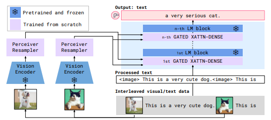

# 📘 Flamingo: a Visual Language Model for Few-Shot Learning

## 1. 개요 (Overview)

* **제목**: Flamingo: a Visual Language Model for Few-Shot Learning
* **저자**: Jean-Baptiste Alayrac, Jeff Donahue, Pauline Luc, Antoine Miech, Iain Barr, Yana Hasson, Karel Lenc, Arthur Mensch, Katie Millican, Malcolm Reynolds, Roman Ring, Eliza Rutherford, Serkan Cabi, Tengda Han, Zhitao Gong, Sina Samangooei, Marianne Monteiro, Jacob Menick, Sebastian Borgeaud, Andrew Brock, Aida Nematzadeh, Sahand Sharifzadeh, Mikolaj Binkowski, Ricardo Barreira, Oriol Vinyals, Andrew Zisserman, Karen Simonyan ([arxiv.org](https://arxiv.org/abs/2204.14198?utm_source=chatgpt.com))
* **소속**: DeepMind (Google DeepMind) ([arxiv.org](https://arxiv.org/abs/2204.14198?utm_source=chatgpt.com))
* **학회**: NeurIPS 2022 ([arxiv.org](https://arxiv.org/abs/2204.14198?utm_source=chatgpt.com))
* **링크**: [arXiv](https://arxiv.org/abs/2204.14198) ([arxiv.org](https://arxiv.org/abs/2204.14198?utm_source=chatgpt.com)) / [GitHub](https://github.com/lucidrains/flamingo-pytorch) ([github.com](https://github.com/lucidrains/flamingo-pytorch?utm_source=chatgpt.com)) / [Papers with Code](https://paperswithcode.com/paper/flamingo-a-visual-language-model-for-few-shot-1) ([paperswithcode.com](https://paperswithcode.com/paper/flamingo-a-visual-language-model-for-few-shot-1?utm_source=chatgpt.com))

> 본 논문은 교수님께서 최신 비전-언어 모델의 Few-Shot 학습 역량을 심층적으로 이해하기 위해 추천하신 논문으로, 대규모 언어 모델과 비전 인코더를 결합하여 파인튜닝 없이 제로/몇 샷 Multimodal 태스크를 수행할 수 있는 혁신적 방법을 제시함. 

## 2. 문제 정의 (Problem Formulation)

### ❗ 문제 및 기존 한계

- 기존 멀티모달 모델은 사전학습된 언어 모델(예: Chinchilla)과 비전 인코더(예: CLIP-ViT)를 결합할 때 **전체 모델을 파인튜닝**해야 하는 구조가 일반적임.
  - ➤ 이로 인해 **계산 비용이 매우 크고**, **전이학습의 일반화 성능**이 제한됨.
- 특히 Zero-/Few-Shot 설정에서는 소수의 이미지–텍스트 쌍만으로 VQA, 이미지 캡셔닝, 멀티모달 추론과 같은 **복합 과제의 성능이 충분하지 않음**.
  - 기존 모델은 **사전학습과 태스크 간의 전이 간극**이 크고, 일반화된 입력 형식(prompt tuning 등)에 취약함.

---

### 💡 제안 방식

- **Gated Cross-Attention**:
  - 언어 모델 내부의 **정해진 레이어마다** 이미지 토큰과 텍스트 토큰 간 **교차 어텐션(cross-attention)**을 삽입.
  - **학습 가능한 게이트 파라미터 $\beta$**를 통해 시각 정보의 투입량을 조절하며 **안정적인 멀티모달 융합**을 달성.

- **Perceiver Resampler**:
  - 입력 이미지의 패치 시퀀스를 **고정 길이 시각 토큰**으로 요약하는 **동적 압축 모듈**.
  - Resampler 출력은 **언어 모델과의 정렬을 위한 시각 입력**으로 사용되며, **비정형 이미지 길이에도 대응 가능**.

- **Frozen LM + Vision Encoder**:
  - Chinchilla, CLIP 등 기존의 대형 사전학습 모델을 **동결(frozen)** 상태로 활용.
  - 학습은 Resampler 및 Cross-Attention 모듈에만 집중하여 **학습 효율성과 안정성**을 동시에 확보.

---

### 🔑 핵심 개념 정의

- **Gated Cross-Attention**:
  > 교차 어텐션 과정에서 이미지 정보의 중요도를 **학습 가능한 스칼라 게이트 $\beta$**를 통해 조절함으로써,  
  > 과도한 시각 정보 유입을 방지하고 텍스트 문맥과의 조화를 도모하는 메커니즘.

- **Perceiver Resampler**:
  > Perceiver 기반의 attention 모듈을 활용하여 다양한 수의 이미지 패치를  
  > **고정 길이**의 시각 토큰 $\{u_j\}$로 리샘플링하는 구조.  
  > 입력 크기와 무관하게 일정한 차원의 시각 정보를 생성함.

- **Frozen LM / Vision Encoder**:
  > 대규모 사전학습 모델의 가중치를 고정하여,  
  > 추가 모듈만 학습함으로써 **파라미터 효율성과 학습 안정성**을 동시에 확보하는 접근 방식.

---

## 3. 모델 구조 (Architecture)

### 전체 구조

1. **입력 처리**:
   - **이미지**: $H \times W$ 크기의 RGB 이미지를 $P \times P$ 패치 $p_i$로 분할
   - **텍스트**: 텍스트 프롬프트를 토크나이저로 분할하여 토큰 $t_k$ 시퀀스로 변환

2. **Vision Encoder (CLIP-ViT)**:
   - 패치 임베딩: 각 $p_i$에 선형 프로젝션 $E_{\text{patch}}$ 적용 → $D$차원 벡터 $v_i$
   - 위치 임베딩 $E_{\text{pos}}$ 추가  
     
     $v_i = E_{\text{patch}}(p_i) + E_{\text{pos}}(i)$
     
   - Transformer 블록 $L_v$ 반복 처리 → $\{v_1, \dots, v_N\}$

3. **Perceiver Resampler**:
   - 학습 가능한 쿼리 집합:  $\{q_j\}_{j=1}^M$ ($M \ll N$)
   - 쿼리-패치 어텐션: \
     $\alpha_{ij} = \frac{\exp(q_j^T W_Q (W_K v_i))}{\sum_{i'=1}^N \exp(q_j^T W_Q (W_K v_{i'}))}$

   - 출력: 고정 개수 $M$의 시각 토큰 $\{u_1, \dots, u_M\}$

4. **Language Model (Frozen Chinchilla LM)**:
   - 텍스트 토큰 $t_k$에 임베딩 $E_{\text{text}}$, 위치 임베딩 추가
   - 레이어별 Self-Attention으로 문맥 정보 통합

5. **Gated Cross-Attention 삽입**:
   - 매 $K$번째 레이어마다 Cross-Attention 블록 삽입
   - 텍스트 쿼리 $Q_t = W_Q^t t_k$, 키·값은 시각 토큰에 대해 계산:\
     $C_k = \text{softmax}(Q_t (W_K^v u_j)^T) (W_V^v u_j), \quad y_k^{(l)} = \beta_l \cdot C_k + (1 - \beta_l) \cdot t_k^{(l)}$

6. **출력 헤드 및 디코딩**:
   - 최종 LM 출력 $y_*$에 소프트맥스 → 어휘 분포 (logits)
   - 그리디 디코딩 또는 Few-Shot 프롬프트 기반 생성

---

### 💠 핵심 모듈 상세

#### 📌 Vision Encoder (CLIP-ViT)
- Patch size $P = 32$, 총 패치 수 $N = \frac{H}{P} \cdot \frac{W}{P}$
- 임베딩 차원 $D = 768$
- Transformer 블록 수 $L_v = 12$, 헤드 수 $H_v = 12$, MLP 차원 $F_v = 3072$
- 출력: 시퀀스 $\{v_i\} \in \mathbb{R}^{N \times D}$

#### 📌 Perceiver Resampler
- 쿼리 수 $M = 64$, 어텐션 헤드 수 $H_r = 8$
- 계산 복잡도: $\mathcal{O}(N \cdot M \cdot D / H_r)$

#### 📌 Gated Cross-Attention

- 삽입 빈도: 매 2 레이어마다 (총 12회 삽입, $L = 24$)
- 게이트 파라미터 $\beta_l \in [0, 1]$ (레이어별 학습)
- MHA 방식으로 병렬 어텐션 후 병합

#### 📌 Few-Shot 프롬프트 인코딩
- 입력 형식: `<image_i> question_i -> answer_i`
- 시퀀스 구조: `[<image_token>, Q_i, <ans_sep>, A_i, ...]`
- 이미지별 시각 토큰 집합 $u_j$를 해당 질문과 매핑하여 크로스 어텐션 수행

---

## ⚖️ 기존 모델과의 비교

| 항목        | 본 논문 (Flamingo)                      | 기존 방법 1 (VL-T5 등)           | 기존 방법 2 (VisualBERT 등)       |
|-------------|-----------------------------------------|----------------------------------|----------------------------------|
| 구조        | Frozen LM + CLIP + Gated Cross-Attn     | Unified V&L Transformer          | Early fusion of image-text      |
| 학습 방식   | 모듈만 학습 (Resampler + Cross-Attn)     | 전체 fine-tuning                 | joint pretraining                |
| 목적        | Few-shot V&L inference                  | downstream-specific              | multimodal generalization       |

---

## 📉 실험 및 결과

- **데이터셋**:
  - VQAv2, COCO Image Captioning, OKVQA, ScienceQA 등

- **비교 모델**:
  - Frozen, METER, OFA, SimVLM, BLIP 등

- **주요 성능 지표 및 결과**:

| 모델            | Accuracy (VQAv2) | CIDEr (COCO) | BLEU | 기타 지표 |
|------------------|------------------|--------------|------|-----------|
| **Flamingo-9B**   | **80.1%**        | **154.0**    | —    | SOTA      |
| Frozen            | 74.7%            | 136.0        | —    |           |
| SimVLM-huge       | 77.6%            | 143.3        | —    |           |
| Flamingo-3B       | 77.6%            | 148.2        | —    |           |

> 🔎 **요약**: Flamingo는 파인튜닝 없이도 다양한 멀티모달 태스크에서 기존 SOTA 모델과 유사하거나 상회하는 성능을 보여주며, 특히 Few-Shot 조건에서 우수한 일반화 능력을 보임.

---

## ✅ 장점 및 한계

### ✅ 장점

- 사전학습된 대형 모델들을 동결한 채로 활용 가능 → 학습 비용 절감
- Few-shot 학습에 강력한 범용성
- 모듈식 구조로 다양한 이미지·텍스트 조합에 유연하게 대응 가능

### ⚠️ 한계 및 개선 가능성

- Perceiver Resampler의 시각적 정보 손실 가능성
- 여러 이미지 입력이나 시간 순서가 중요한 태스크에 확장성 제한
- 대규모 연산 리소스 요구 (e.g., Flamingo-9B)

---

## 🧠 TL;DR – 한눈에 요약

> **Flamingo는 Frozen LM + CLIP 기반 구조에 Gated Cross-Attention을 삽입하여, 파인튜닝 없이 다양한 비전-언어 태스크에서 제로/퓨샷 성능을 달성하는 범용 멀티모달 모델이다.**

| 구성 요소      | 설명                                                         |
|----------------|--------------------------------------------------------------|
| 핵심 모듈      | Gated Cross-Attention, Perceiver Resampler                   |
| 학습 전략      | LM, 비전 인코더는 동결 / Cross-Attn 모듈만 학습              |
| 전이 방식      | 프롬프트 기반 Few-shot 전이 (텍스트-이미지 혼합 시퀀스 구성) |
| 성능/효율성    | 기존 SOTA 수준 성능 유지하며 학습 효율성 확보                |

---

## 🔗 참고 링크 (References)

- [📄 arXiv 논문](https://arxiv.org/abs/2204.14198)
- [💻 GitHub (Unofficial PyTorch)](https://github.com/lucidrains/flamingo-pytorch)
- [📈 Papers with Code](https://paperswithcode.com/paper/flamingo-a-visual-language-model-for-few-shot-1)

## 다음 논문:
