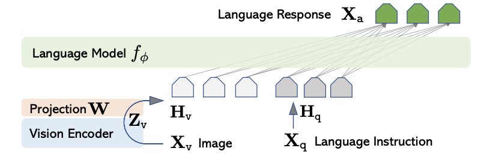

# 📘 [Visual Instruction Tuning: LLaVA (Large Language and Vision Assistant)]

## 1. 개요 (Overview)

- **제목**: Visual Instruction Tuning  
- **저자**: Haotian Liu, Chunyuan Li, Qingyang Wu, Yong Jae Lee  
- **소속**: University of Wisconsin-Madison, Microsoft Research, UC Davis  
- **학회**: arXiv preprint (2023)  
- **링크**:  
  - [arXiv](https://arxiv.org/abs/2304.08485)  
  - [GitHub](https://github.com/haotian-liu/LLaVA)  
  - [Papers with Code](https://paperswithcode.com/paper/visual-instruction-tuning)

> 최근 멀티모달 AI 시스템에 대한 수요가 증가함에 따라, GPT와 같은 대형 언어 모델(LLM)에 시각적 입력을 결합하는 시도가 활발히 이뤄지고 있다.  
> LLaVA는 이러한 트렌드 속에서, OpenAI의 CLIP 비전 인코더와 Meta의 LLaMA 언어 모델을 연결하여 멀티모달 인스트럭션 튜닝을 적용한 대표적인 오픈소스 모델이다.  
> 이 논문은 LLaVA를 통해 시각 정보와 자연어 명령을 결합한 질의응답, 시각적 설명, 이미지 기반 대화 등 다양한 작업에서 강력한 성능을 보이며, 비공개 모델(GPT-4 with Vision 등)에 대응할 수 있는 고성능 오픈 대안임을 보여준다.

---

## 2. 문제 정의 (Problem Formulation)

**문제 및 기존 한계**:

* 기존 대형 언어 모델(LLM)은 자연어 처리에 뛰어난 성능을 보였으나, 시각 정보를 처리할 수 없어 **이미지와 언어를 결합한 멀티모달 상호작용**에는 한계가 있음.  
* CLIP 등 멀티모달 모델은 이미지-텍스트 쌍의 표현 학습에는 강점이 있으나, **대화형 질의응답, 다단계 추론, 고차원 멀티턴 상호작용**에는 적합하지 않음.  
* 기존 비전-언어 모델 대부분은 **제한된 task-specific 학습** 또는 **사전 정의된 응답만 생성**하며, 범용성과 유연성이 부족했음.

**제안 방식**:

* LLaVA는 **LLaMA 언어 모델과 CLIP 비전 인코더를 연결**하여, 시각적 정보를 자연어로 이해하고 응답하는 **범용 멀티모달 어시스턴트**를 제안함.  
* 특히, 텍스트 기반 instruction tuning 방식을 시각 정보에 확장한 **Visual Instruction Tuning**을 도입하여, 사용자 질의에 맞춰 이미지 기반 자연어 응답을 생성할 수 있도록 학습함.  
* 시각 인코더의 출력을 **투명하게 language model의 입력 토큰 공간으로 투영(project)**하여, **기존 LLM을 수정 없이 활용**할 수 있는 구조를 설계함.

> ※ **핵심 개념 정의**  
> - **Visual Instruction Tuning**: 텍스트-이미지 쌍을 기반으로 instruction-following 형태로 멀티모달 모델을 학습하는 방식.  
> - **Projection Layer**: CLIP의 시각 피처(768-d)를 LLaMA의 텍스트 임베딩 차원(4096-d)으로 선형 매핑하는 계층.  
> - **Multimodal Dialogue**: 텍스트 + 이미지 입력을 바탕으로 다중 턴(멀티턴)의 자연어 대화 생성.

---

## 3. 모델 구조 (Architecture)

### 전체 구조

LLaVA는 "Large Language and Vision Assistant"라는 이름 그대로, 시각 정보(이미지)와 언어(텍스트)를 동시에 이해하고 응답할 수 있는 멀티모달 모델이다.  
이 모델은 세 가지 주요 구성 요소로 이루어진다:

1. **Vision Encoder (CLIP ViT-L/14)**: 이미지를 벡터로 임베딩
2. **Projection Layer**: 시각 임베딩을 언어 모델 입력에 맞게 선형 변환
3. **Language Model (LLaMA)**: 멀티모달 입력을 바탕으로 자연어 응답 생성

입력은 `(이미지, 텍스트 프롬프트)` 형태이며, 출력은 순수 텍스트 응답이다. 이 전체 흐름은 **instruction-following 멀티모달 대화**를 구현한다.

---

### 💠 핵심 모듈 또는 구성 요소

#### 📌 Vision Encoder: CLIP ViT-L/14

* OpenAI의 **CLIP (Contrastive Language-Image Pretraining)** 모델 중 Vision Transformer (ViT-L/14)를 사용.
* 이미지 $I$는 $224 \times 224$ 해상도로 입력되며, patch 단위로 분해된 후 임베딩됨.
* 최종적으로 얻는 것은 **[CLS] 토큰의 임베딩 벡터** $v \in \mathbb{R}^{768}$로, 이미지 전체를 대표하는 압축 표현이다.
* 이 표현은 CLIP 텍스트 인코더와의 공동 학습을 통해 자연 언어 공간과 의미적으로 정렬(aligned)된 상태임.

> 기존 멀티모달 모델들과 달리, LLaVA는 **이미 학습된 CLIP의 표현력을 직접 활용**하여 zero-shot generalization을 강화함.

---

#### 📌 Projection Layer: Vision-to-Text Token Embedding

CLIP의 출력 $v$는 LLaMA의 입력 토큰과 차원이 다르기 때문에, 직접 연결할 수 없다.  
이를 해결하기 위해 LLaVA는 학습 가능한 **선형 변환 계층 (projection layer)**를 도입한다.

* 수식으로 표현하면 다음과 같다:

  $z = W \cdot v + b$

  여기서  
  - $v \in \mathbb{R}^{768}$: CLIP의 [CLS] 출력  
  - $W \in \mathbb{R}^{4096 \times 768}$: 투영(weight) 행렬  
  - $b \in \mathbb{R}^{4096}$: 바이어스  
  - $z \in \mathbb{R}^{4096}$: LLaMA 임베딩 차원으로 확장된 벡터

* 이 변환은 CLIP의 시각 정보가 마치 **하나의 가상 토큰(token)**처럼 LLaMA 입력에 삽입될 수 있도록 해준다.
* 실제로는 여러 개의 투영 벡터를 만들 수 있으며, 이 수를 $n_{image\ tokens}$이라 하면:

  $\text{Image tokens} = \{ z_1, z_2, \dots, z_{n} \} \subset \mathbb{R}^{4096}$

---

#### 📌 Language Model: LLaMA (7B 또는 13B)

* Meta의 **LLaMA-7B 또는 13B** 모델을 그대로 사용한다.
* 이미지 투영 토큰과 텍스트 프롬프트가 시퀀스로 이어진 후, LLaMA는 이를 입력으로 받아 자연어 응답을 생성한다:

  $\text{Input to LLaMA: } \quad [\text{Image Tokens}] + [\text{Text Prompt Tokens}]$

* 모델은 기존 LLaMA 아키텍처를 수정하지 않기 때문에, 이미 학습된 LLM의 언어적 추론 능력을 그대로 유지할 수 있다.

> 결과적으로, LLaVA는 멀티모달 task를 위해 **최소한의 변경만 가해진 매우 효율적인 구조**를 갖는다.

---

### 🔁 처리 흐름 요약

1. 입력 이미지 $I$ → CLIP ViT → 시각 피처 $v$
2. $v$ → Projection Layer → 이미지 토큰 $z$
3. 텍스트 프롬프트 $T$와 함께 $z$를 LLaMA에 입력
4. LLaMA → 최종 응답 텍스트 $\hat{y}$ 생성

$\hat{y} = \text{LLaMA}([z_1, z_2, ..., z_n] + [T_1, T_2, ..., T_m])$

---

> 📌 **요약**:  
> LLaVA는 **이미지를 언어 모델의 입력으로 변환하는 구조적 인터페이스를 설계**하고, CLIP과 LLaMA를 효과적으로 결합하여 instruction-following 기반의 강력한 비전-언어 어시스턴트를 구현하였다.  
> 이 구조는 단순하면서도 확장성 높은 접근 방식이며, 다양한 downstream 멀티모달 응용에 손쉽게 적용 가능하다.

---
## ⚖️ 기존 모델과의 비교

| 항목        | 본 논문 (LLaVA)                     | BLIP-2                          | Flamingo                          |
| --------- | ----------------------------------- | ------------------------------ | --------------------------------- |
| 구조        | CLIP ViT + Projection + LLaMA         | ViT-G + Q-Former + OPT/FlanT5   | Perceiver Resampler + Chinchilla |
| 학습 방식     | Visual Instruction Tuning (Supervised) | Two-stage Pretrain + Fine-tune | Frozen LM + Few-shot Adaptation  |
| 목적        | Open-source V-L Assistant             | Vision-to-Language Generation  | General Multimodal Few-shot Tasks |

> LLaVA는 구조적 단순성과 공개성(Open-Source)을 동시에 추구하며, instruction-following에 최적화되어 있음.  
> 반면, BLIP-2는 다양한 Vision-to-Language task에 범용적이며, Flamingo는 large-scale, few-shot 설정에 강점을 가짐.

---

## 📉 실험 및 결과

* **데이터셋**:
  - COCO Captioning
  - VQAv2 (Visual Question Answering)
  - ScienceQA (이미지 기반 문제 풀이)
  - GPT-4 기반 Human Evaluation

* **비교 모델**:
  - BLIP-2 (OPT/FlanT5)
  - MiniGPT-4
  - Flamingo (Chinchilla 기반)
  - OpenAI GPT-4 with Vision (참고용)

* **주요 성능 지표 및 결과**:

| 모델           | VQAv2 Accuracy | ScienceQA Accuracy | GPT-4 평가 (상대 점수) |
| ------------- | --------------- | ------------------- | -------------------- |
| 본 논문 (LLaVA) | 56.9%          | **92.5%**            | **+1.0 (vs MiniGPT-4)** |
| BLIP-2         | 55.3%          | 83.0%               | -                    |
| MiniGPT-4      | 56.1%          | 89.5%               | baseline             |
| Flamingo       | 56.3%          | -                   | -                    |

> LLaVA는 instruction tuning 기반의 간단한 구조임에도 불구하고 **ScienceQA 같은 reasoning 중심의 멀티모달 과제에서 가장 높은 정확도**를 보였다.  
> 특히, **GPT-4 기반 사람 평가에서 MiniGPT-4 대비 응답의 질이 높게 평가**되었으며, 실용성 및 응답 일관성에서도 우위를 보임.

---

## ✅ 장점 및 한계

### **장점**:

* 💡 **심플한 구조**: 기존 LLM을 거의 수정하지 않고 vision 입력만 연동해 활용 가능  
* 📚 **오픈소스 기반**: CLIP + LLaMA 모두 공개된 모델을 사용하여 학계/산업에서 재현 용이  
* 📈 **다양한 작업에서 강력한 성능**: captioning, QA, instruction-following까지 커버  
* 🔄 **Instruction Tuning 활용**: 일반적인 자연어 명령형 task에 유연하게 대응 가능

### **한계 및 개선 가능성**:

* 🧠 **멀티 이미지, 비디오 등 시계열 입력에는 미대응**  
* ⚠️ **복잡한 시각 reasoning은 한계 있음 (e.g., spatial reasoning, object counting)**  
* 🧪 CLIP representation이 고정되어 있어 시각 정보의 fine-grained 조정이 어려움  
* 🔧 Multimodal alignment 문제가 완전히 해결된 것은 아님 (투영 단일 층 사용)

---

## 🧠 TL;DR – 한눈에 요약

> LLaVA는 CLIP + LLaMA를 projection layer로 연결하고, visual instruction tuning을 통해 GPT-4 수준의 멀티모달 성능을 지향하는 오픈소스 멀티모달 어시스턴트이다.

| 구성 요소    | 설명 |
| ----------- | ---- |
| 핵심 모듈    | CLIP Vision Encoder + Linear Projection + LLaMA |
| 학습 전략    | Text-Image 기반 Instruction Tuning (Supervised) |
| 전이 방식    | Vision → LLM Input Embedding 공간으로 선형 투영 |
| 성능/효율성 | 구조가 단순하고 재현 가능하며, 다양한 멀티모달 task에서 경쟁력 확보 |

---

## 🔗 참고 링크 (References)

* [📄 arXiv 논문](https://arxiv.org/abs/2304.08485)
* [💻 GitHub](https://github.com/haotian-liu/LLaVA)
* [📈 Papers with Code](https://paperswithcode.com/paper/visual-instruction-tuning)

---

## 다음 논문:

> flamingo
