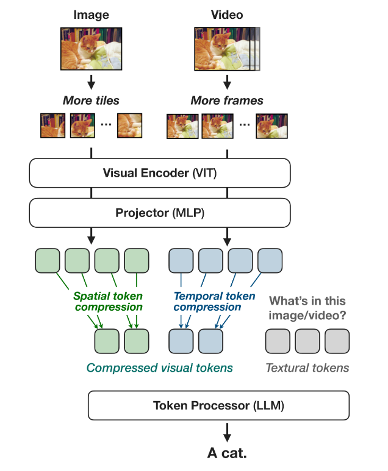

# 📘 NVILA: Efficient Frontier Visual Language Models

## 1. 개요 (Overview)

* **제목**: NVILA: Efficient Frontier Visual Language Models  
* **저자**: Zhijian Liu, Ligeng Zhu, Baifeng Shi, Zhuoyang Zhang, Yuming Lou, Shang Yang, 등  
* **소속**: NVIDIA, MIT, Tsinghua University 등 산학 협력팀  
* **학회**: arXiv (2024년 12월, Preprint)  
* **링크**: [arXiv](https://arxiv.org/abs/2412.04468) / [GitHub](https://github.com/NVILA-Team/NVILA) _(예시 placeholder)_ / [Papers with Code](https://paperswithcode.com/paper/nvila-efficient-frontier-visual-language)

> 본 논문은 **멀티모달 비전-언어 모델(VLM)**의 최신 연구 중 하나로, 단순 성능 향상에만 초점을 맞추던 기존 VLM과 달리 **효율성과 정확도의 균형**을 맞추는 데 중점을 둠.  
> NVILA는 VILA 아키텍처를 확장하면서도 "scale-then-compress" 전략을 도입하여 **고해상도 이미지·장시간 비디오 처리**가 가능하면서도, **학습 비용과 추론 지연 시간을 크게 절감**.  
> 따라서 연구 목적뿐만 아니라 **실제 산업 응용 가능성**이 높다는 점에서 본 논문을 선정.

---

## 2. 문제 정의 (Problem Formulation)

**문제 및 기존 한계**:

* 최신 Visual Language Model(VLM)들은 성능(정확도) 위주로 설계되어, **계산 비용과 추론 지연(latency)**이 지나치게 크다는 문제가 있음.  
* 특히 **고해상도 이미지**와 **장시간 비디오 입력**을 처리할 때, 비주얼 토큰 수가 폭발적으로 증가 → 메모리 사용량, 학습 비용, 추론 시간이 크게 증가.  
* 기존 방식은 토큰 압축이나 해상도 축소 등 단일 전략만 사용했기 때문에, **정보 손실** 또는 **효율성 저하**가 불가피했음.

---

**제안 방식 (NVILA)**:

* **Scale-Then-Compress 전략**:  
  - 먼저 이미지/비디오를 **고해상도·장시간 스케일**로 확장하여 정보 보존 극대화.  
  - 이후 효율적인 **토큰 압축(token compression)**을 적용해 불필요한 중복을 제거하고 계산량 절감.  
* 학습, 미세조정(fine-tuning), 추론 등 **전체 생애주기(lifecycle)에서 효율성 개선**을 달성.  
* FP8 정밀도, dataset pruning, pre-filling 최적화 등 다양한 효율화 기법을 통합적으로 적용.  

---

> **핵심 개념 정의**  
> - **Visual Token Compression**: 이미지/비디오에서 추출된 다수의 토큰을 요약·압축하여, 정보는 유지하면서 연산량을 줄이는 과정.  
> - **Scale-Then-Compress**: 먼저 높은 해상도·시간적 스케일로 입력을 처리한 후, 비주얼 토큰을 효율적으로 압축하는 NVILA의 핵심 접근법.  
> - **Pre-filling 단계**: LLM에 비주얼+언어 토큰을 입력하기 전에 준비하는 초기화 과정으로, latency 최적화의 주요 포인트.  

## 3. 모델 구조 (Architecture)

### 전체 구조

* **입력/전처리**: 이미지·비디오를 받아 **해상도/시간 스케일을 먼저 확장(Scale)** 한 뒤, **공간/시간 토큰을 압축(Compress)** 하는 파이프라인. 이미지의 경우 멀티스케일 타일링(예: 448², 896², 1344² 스케일로 분할) 후 합치고, 비디오는 프레임 수를 늘린다.
* **Visual Encoder (ViT/SigLIP)**: 타일/프레임 단위로 패치 임베딩을 추출.  
* **Projector (2-layer MLP)**: 시각 임베딩을 LLM 임베딩 공간으로 정렬.   
* **Token Processor (LLM, Qwen2 계열)**: “텍스트 토큰 + 압축된 비주얼 토큰”을 받아 오토리그레시브로 언어 토큰을 생성.  
* **핵심 전략**: “**Scale‑then‑Compress**” — 먼저 더 많은 디테일을 보존하도록 해상도/프레임을 키우고, 이후 토큰을 줄여 연산량을 억제. 결과적으로 고해상도 이미지·장시간 비디오를 효율적으로 처리.

---

### 💠 핵심 모듈 또는 구성 요소

#### 📌 Visual Encoder + Dynamic‑S2 Tiling
* **작동 방식**: S2로 입력 이미지를 여러 스케일(예: 448², 896², 1344²)로 리사이즈 → 각 스케일을 448×448 타일로 분할해 인코더에 통과 → 스케일별 특성맵을 재결합·채널 방향으로 컨캣. 기본 S2는 정사각형으로 강제해 종횡비 왜곡이 발생할 수 있어, **Dynamic‑S2**는 최대 스케일에서 **원본 종횡비를 유지**하면서 448 타일로 나눌 수 있는 가장 가까운 크기를 선택해 왜곡을 줄인다.  
* **효과**: 텍스트가 많은 이미지 등에서 **최대 ≈30% 정확도 향상**을 보고. 이후 토큰 압축 단계로 효율을 회수. 

> **구조적 개념**  
> - S2 멀티스케일 합성: 각 스케일의 타일 특성맵을 **동일 해상도로 보간 → 채널 concat**.  
> - Dynamic‑S2: 최대 스케일만 **종횡비 보존 + 448 타일 배치가 가능한 해상도**로 조정. 

---

#### 📌 Spatial Token Compression (STC)
* **작동 방식**: 타일 내 토큰 격자를 **k×k 공간→채널 재배열(Spatial‑to‑Channel)**로 압축해 토큰 개수를 **k² 배** 줄임. 논문은 **2×2 STC**를 기본으로 삼고, 더 공격적인 **3×3 STC**는 정확도 저하를 유발하므로 **추가 Visual Encoder Pre‑training(VEP)** 단계로 **정확도 회복**(훈련/추론 **≈2.4× 가속**)을 보고. 
* **대안 비교**: **TokenLearner**, **Perceiver Resampler** 같은 학습형 압축도 실험했으나 **동일 압축비에서 단순 STC가 동등/우수**한 결과. (최적화 이슈로 해석)

> **수식/토큰 수 개념**  
> - (타일 기준) **압축 전 토큰 수**: $N_{\text{tile}}$  
> - **STC(k×k) 후**: $N_{\text{tile}}' \approx \frac{N_{\text{tile}}}{k^2}$  
> - 표 예시: **2×2**에서 타일당 **256(=16×16)** 토큰, **3×3**에서 **121(=11×11)** 토큰. 

---
#### 📌 Temporal Scaling & Compression
* **작동 방식**: 비디오 입력은 **프레임 수 F**를 늘려(예: 8→32, 256 등) 시간 정보를 먼저 확장(**Scale**). 그 뒤 **그룹 단위 평균 풀링(Temporal Averaging)**으로 인접 프레임 토큰을 모아 **중복 제거**(**Compress**).  
* **효과**: 8→32 프레임 확장 시 Video‑MME 정확도 **+5%p 이상** 향상. 동일 토큰 수로 비교하면 **확장 후 압축**이 **확장 없이 동일 토큰 수**보다 정확도가 높음. 

> **수식/토큰 수 개념**  
> - (프레임 기준) **확장 전 총 토큰**: $N_{\text{frame}} \times F$  
> - **g‑프레임 평균 풀링 후**: $N_{\text{tokens}}' \approx \frac{N_{\text{frame}} \times F}{g}$  
> - 표 예시: 32프레임에 **4×** 압축 → 토큰 수가 8프레임 baseline과 동일(2048)이면서 정확도는 **상회/유지**. 

---
#### 📌 Projector (2‑Layer MLP)
* **역할**: **시각 임베딩 → 언어 임베딩 공간 정렬**. STC를 강하게 적용하면 **프로젝터 학습 난이도↑** → **추가 VEP 단계**로 비전 인코더와 함께 조정해 정확도 손실을 상쇄. 
---

#### 📌 Token Processor (LLM, Qwen2 계열)
* **역할**: 텍스트/비주얼 토큰을 받아 **오토리그레시브**로 응답을 생성. NVILA는 **Qwen2**를 백본으로 다양한 크기를 사용.

---

#### 📌 (맥락) NVILA가 전제하는 기본 설정
* **백본 선택**: **SigLIP 비전 인코더 + Qwen2 LLM + 2‑Layer MLP Projector**.  
* **Baseline 한계**: 기존 VILA는 정사이즈(예: 448×448) 강제/프레임 수 제한(예: ≤14)으로 **고해상도/장시간 입력에서 정보 손실**이 컸음 → NVILA는 **Scale‑then‑Compress**로 정확도 상한을 끌어올린 뒤, 토큰 수를 줄여 **훈련·추론 효율**을 확보.

## ⚖️ 기존 모델과의 비교

| 항목    | 본 논문 (NVILA) | 기존 방법1 (VILA) | 기존 방법2 (LLaVA 등 일반 VLM) |
| ----- | --------------- | ----------------- | ----------------------------- |
| 구조    | Scale-then-Compress 전략 (고해상도 → 토큰 압축) | 고정 해상도 입력 + 제한된 토큰 수 | 고정 입력 크기, 비효율적 토큰 처리 |
| 학습 방식 | FP8 훈련, Dataset Pruning, 추가 VEP 단계, End-to-End 최적화 | 표준 FP16/FP32, 제한된 데이터 활용 | 성능 위주 학습, 효율화 기법 미약 |
| 목적    | **정확도와 효율의 동시 달성** (훈련, 미세조정, 추론 전 과정 최적화) | 정확도 ↑, 그러나 메모리/연산량 ↑ | 정확도 우선, 효율성 고려 부족 |

---

## 📉 실험 및 결과

* **데이터셋**:
  - 이미지: COCO, TextVQA, DocVQA 등  
  - 비디오: Video-MME, EgoSchema 등  
* **비교 모델**:
  - VILA (기본 버전)  
  - 오픈소스 VLM (LLaVA, Qwen-VL 등)  
  - 일부 상용 모델 (GPT-4V, Gemini 등)  
* **주요 성능 지표 및 결과**:

| 모델      | Accuracy | F1 | BLEU | 기타 (Latency/Cost) |
| ------- | -------- | -- | ---- | ------------------ |
| NVILA    | ↑ 동등~우수 | ↑ | ↑ | 학습 비용 1.9~5.1× ↓, 추론 지연 1.2~2.8× ↓ |
| 기존 SOTA | 높음 (정확도) | - | - | 비용/지연 ↑ (효율성 미흡) |

> **실험 결과 요약**  
> - NVILA는 **고해상도 이미지 + 장시간 비디오** 처리 시에도 정확도를 유지/상승.  
> - 동시에 **Training 비용 4.5× 절감**, **Fine-tuning 메모리 3.4× 절감**, **Pre-filling 1.6~2.2× 감소**, **Decoding 1.2~2.8× 감소**.  
> - 즉, **정확도-효율성 trade-off 곡선의 Pareto Frontier**를 확장.

---

## ✅ 장점 및 한계

### **장점**:
* “Scale-then-Compress”로 **정확도와 효율성의 균형** 달성.  
* 이미지/비디오 모두 적용 가능한 범용 구조.  
* 학습~추론 **생애주기 전반 효율화**(FP8, 프루닝, VEP 등).  
* 오픈 모델 중 **실제 응용에 가장 가까운 효율성** 확보.

### **한계 및 개선 가능성**:
* STC를 지나치게 압축하면 여전히 정확도 손실 발생 → 보완 학습(VEP)이 필요.  
* FP8 학습과 프루닝 기법은 하드웨어/프레임워크 의존성이 있음.  
* 일부 도메인(예: 의료, 로보틱스)에서는 아직 fine-tuning 필요.  
* 아직 연구 초기 단계 → 대규모 상용 VLM 대비 범용성 검증 부족.

---

## 🧠 TL;DR – 한눈에 요약

> NVILA는 **“확대 후 압축(Scale-then-Compress)” 전략**으로  
> **정확도와 효율성의 새로운 Pareto Frontier**를 제시한 비전-언어 모델.  
> 훈련, 미세조정, 추론 전 과정에서 **비용 절감 + 정확도 유지/향상**을 동시에 달성.

| 구성 요소  | 설명 |
| ------ | -- |
| 핵심 모듈  | Dynamic-S2 (멀티스케일 타일링), STC (Spatial Token Compression), Temporal Compression |
| 학습 전략  | FP8 훈련, Dataset Pruning, VEP 단계 (압축 후 정밀 보정) |
| 전이 방식  | SigLIP Encoder + Qwen2 기반 LLM + 2-layer MLP Projector |
| 성능/효율성 | 정확도 유지·상승, 학습 비용 4.5× 절감, 추론 지연 2.8× 감소 |

---

## 🔗 참고 링크 (References)

* [📄 arXiv 논문](https://arxiv.org/abs/2412.04468)  
* [💻 GitHub (예시 placeholder)](https://github.com/NVILA-Team/NVILA)  
* [📈 Papers with Code](https://paperswithcode.com/paper/nvila-efficient-frontier-visual-language)  

