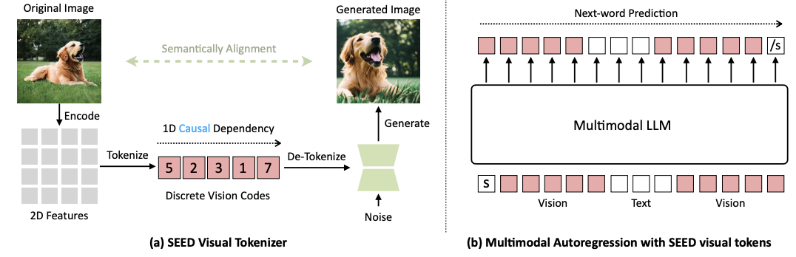
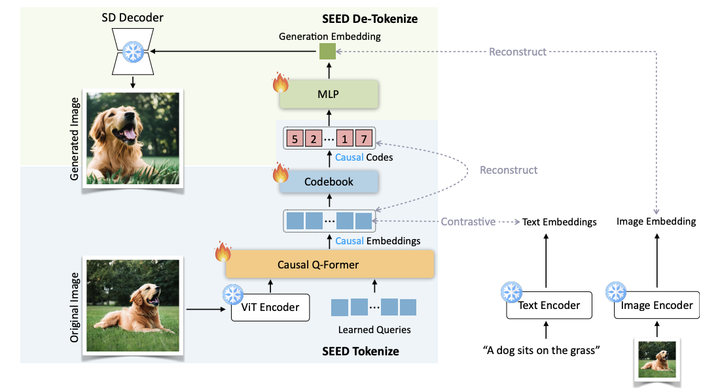
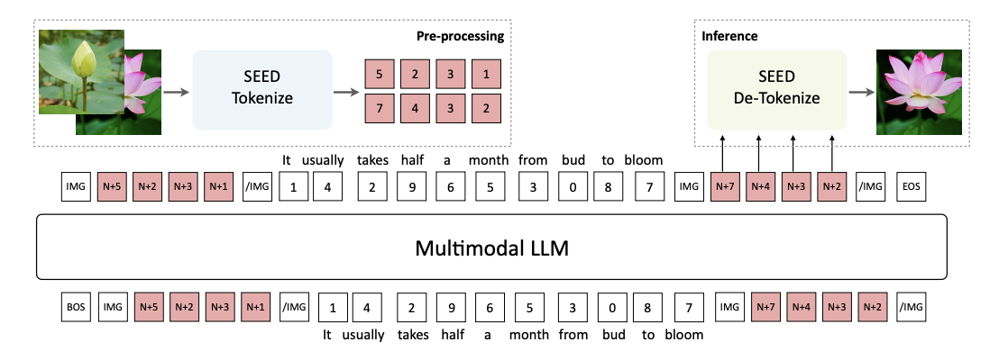

# 📘 Making LLaMA SEE and Draw with SEED Tokenizer

## 1. 개요 (Overview)

- **제목**: Making LLaMA SEE and Draw with SEED Tokenizer  
- **저자**: Yuzhe Wang, Yufei Wang, Jiacheng Ye, Shupeng Liu, Hang Su, Jun Zhu  
- **소속**: Tsinghua University, Beijing Academy of Artificial Intelligence (BAAI)  
- **학회**: arXiv preprint (2023.10, arXiv:2310.01218)  
- **링크**: [arXiv](https://arxiv.org/abs/2310.01218) / [GitHub](https://github.com/THUDM/SEED) / [Papers with Code](https://paperswithcode.com/paper/making-llama-see-and-draw-with-seed-tokenizer)

> 최근 Vision-Language 모델은 텍스트 기반의 생성 능력을 넘어서 시각적 개체의 이해와 생성까지 요구받고 있다. 본 논문은 기존 LLaMA 언어 모델에 시각적 표현력을 부여하기 위해, 이미지와 텍스트를 동일한 시퀀스 내에서 다룰 수 있는 **SEED Tokenizer**를 제안한다. 특히, 이미지를 discrete token으로 표현하고 다시 복원 가능한 구조를 통해, LLaMA 기반 모델이 이미지를 '보고 그리고' 이해하는 능력을 갖추게 된다.  
> Diffusion이나 Auto-regressive 기반의 기존 방법들과 비교해 학습 효율성과 범용성이 높아, 다양한 VLM/Multimodal 분야에 응용 가능성이 크다고 판단하여 본 논문을 선정하였다.
> 이후 연구하고 싶은 내용이 이 분야여서 읽고 싶었다.

---

## 2. 문제 정의 (Problem Formulation)

**문제 및 기존 한계**:

* 기존의 Vision-Language Models (VLMs)는 텍스트는 토큰(token) 단위로 처리하는 반면, 이미지는 CNN feature map, CLIP embedding 등 이질적인 continuous 표현으로 다뤄져 **텍스트와 이미지 간의 동등한 시퀀스 처리가 불가능**했음.
* 이로 인해 텍스트 전용 언어 모델(예: LLaMA)을 멀티모달 입력에 바로 활용하기 어렵고, 단일 Transformer로 이미지와 텍스트를 함께 이해하고 생성하는 구조를 구축하기 힘들었음.
* 기존 discrete image tokenizer(ViT-VQGAN 등)는 autoregressive 복원 품질이 낮거나 텍스트-이미지 간 alignment가 떨어지는 문제가 있었음.

**제안 방식**:

* 이미지와 텍스트를 **동일한 token vocabulary**로 표현할 수 있도록, **SEED (Semantically Enhanced Encoder-decoder Discretizer) Tokenizer**를 제안함.
* SEED는 high-fidelity discrete image tokens를 생성하며, 이 token들은 언어 모델과 동일한 vocabulary 및 positional encoding을 공유함.
* 이를 통해 LLaMA와 같은 언어 모델이 **이미지를 마치 문장처럼 다룰 수 있게** 되어, multimodal pretraining 없이도 이미지 이해 및 생성 능력을 획득할 수 있음.

> ※ **핵심 개념 정의**  
> - **SEED Tokenizer**: 이미지 입력을 high-level semantic discrete token 시퀀스로 변환하는 모듈. Auto-regressive reconstruction이 가능하며, 기존 VQ-based tokenizer보다 alignment와 재현 품질이 뛰어남.  
> - **Visual Vocabulary Sharing**: 텍스트와 이미지가 동일한 token embedding space를 공유하여 unified modeling을 가능하게 하는 설계.

---

## 3. 모델 구조 (Architecture)



### 전체 구조

* 전체 시스템은 **SEED Tokenizer**와 **LLaMA 언어 모델**을 결합하여, 이미지와 텍스트를 **동일한 시퀀스 상에서 처리**하는 구조로 설계됨.
* 입력은 텍스트와 이미지로 구성되며, 이미지는 먼저 SEED Tokenizer를 통해 discrete token 시퀀스로 변환됨.
* 이 시퀀스는 텍스트와 함께 LLaMA 모델에 입력되고, 출력 시에는 이미지 생성, 설명 생성(image captioning), 질의응답 등 다양한 멀티모달 태스크를 수행할 수 있음.
* 출력 시, 생성된 이미지 토큰은 다시 SEED Tokenizer의 디코더를 통해 high-resolution 이미지로 복원됨.

---

### 💠 핵심 모듈 또는 구성 요소

#### 📌 SEED Tokenizer (Semantically Enhanced Encoder-Decoder Discretizer)



**목표**: 이미지를 discrete한 token 시퀀스로 변환하면서, semantic fidelity와 autoregressive 복원 성능을 모두 확보하는 것.

##### 구조 구성:

1. **Encoder**:  
   - Conv stem → Vision Transformer (ViT) 구조 기반
   - 입력 이미지를 latent feature로 압축 (size: 16x16 or 32x32)
   - Semantic embedding space에서 표현

2. **Codebook (VQ module)**:  
   - 기존 VQ-VAE와 유사하지만, 더 정교한 attention 기반 quantization을 사용  
   - latent vector를 **learnable codebook vector**로 매핑  
   - discrete token `z ∈ ℤⁿ` 생성  
   - Latent는 L2 distance 기반 nearest neighbor를 통해 quantized됨

3. **Decoder**:  
   - Image reconstruction을 위한 autoregressive decoder 사용 (Transformer 기반)  
   - cross-entropy loss + perceptual loss를 통해 학습  
   - 실제 이미지를 고품질로 재구성 가능

##### 수식 요약:

```math
\text{Encoder: } \mathbf{h} = f_{\text{enc}}(\mathbf{x})

\text{Quantization: } z_i = \arg \min_j \|\mathbf{h}_i - \mathbf{e}_j\|_2

\text{Decoder: } \hat{\mathbf{x}} = f_{\text{dec}}(\{ \mathbf{e}_{z_i} \})
```
#### 📌 Visual Vocabulary Sharing

텍스트와 이미지 모두 **동일한 token embedding space를 공유**함으로써, LLaMA 언어 모델이 이미지 token을 native하게 처리할 수 있도록 함.

`positional embedding`도 공유하여, 시퀀스 상에서 이미지 token이 자연스럽게 이어질 수 있도록 설계.

이를 통해 **extra multimodal fusion 모듈 없이**, 텍스트 전용 LLM(LLaMA)을 그대로 사용 가능함.

---



#### 📌 LLaMA 기반 Multimodal Inference

기존 LLaMA의 **decoder-only 구조는 변경 없이 사용**됨.

SEED Tokenizer를 통해 이미지가 discrete token으로 처리되므로, **텍스트 + 이미지 토큰을 단일 시퀀스로 처리** 가능함.

텍스트 생성, 이미지 생성, multimodal QA 등의 작업에서 **cross-modality alignment pretraining 없이도 zero-shot 또는 few-shot 성능 확보** 가능.

---

#### 📌 Training Objective

**SEED Tokenizer와 LLaMA는 따로 학습**되며, end-to-end 학습이 아닌 **모듈 분리 학습 방식** 사용:

- **SEED Tokenizer**:  
  - `VQ loss` + `perceptual loss` + `auto-regressive reconstruction loss`로 학습  
  - 목표: **정보 손실 없이 discrete 표현으로 이미지를 압축**

- **LLaMA 기반 VLM**:  
  - 기존 언어 모델 학습 objective 유지 (**Causal LM loss**)  
  - 다만 입력 시 **SEED 토큰을 포함하여 이미지 입력을 모델에 노출**

```math
\mathcal{L}_{\text{SEED}} =
\underbrace{ \| x - \hat{x} \|_2^2 }_{\text{recon}} +
\underbrace{ \lambda \cdot \mathcal{L}_{\text{perc}} }_{\text{perceptual}} +
\underbrace{ \mathcal{L}_{\text{VQ}} }_{\text{quantization}}
```
이 구조 덕분에 기존의 LLaMA 또는 텍스트 전용 LLM이 별도의 구조 변경 없이 이미지 입력과 출력을 직접 다룰 수 있게 되었으며, 복잡한 cross-attention 모듈이나 joint training 없이도 높은 성능을 달성함.


## ⚖️ 기존 모델과의 비교

| 항목      | 본 논문 (SEED-LLM)                             | Flamingo                              | BLIP-2                            |
|-----------|-----------------------------------------------|----------------------------------------|-----------------------------------|
| 구조      | Unified single-stream (LLM only, no fusion)   | Dual-stream with cross-attention      | Two-stage (frozen vision encoder + Q-Former + LLM) |
| 학습 방식 | Separate training (SEED tokenizer + LLaMA)     | Large-scale multimodal pretraining     | Vision-language pretraining + LLM alignment |
| 목적      | Vision-text bidirectional generation & reasoning | Multimodal few-shot inference          | Efficient vision-to-text understanding |

---

## 📉 실험 및 결과

* **데이터셋**:
  - COCO Captions
  - VQAv2
  - Flickr30k
  - OKVQA
  - ImageNet (zero-shot classification)
  - DrawBench (이미지 생성 평가)
  - MS-COCO (FID/Inception Score 등 이미지 생성 지표)

* **비교 모델**:
  - Flamingo
  - BLIP-2
  - GIT
  - LLaVA
  - PaLI

* **주요 성능 지표 및 결과**:

| 모델         | VQA Accuracy | COCO BLEU-4 | FID ↓ (생성) | 기타 |
|--------------|--------------|-------------|--------------|------|
| **SEED-LLM** | 77.5         | 33.2        | **6.17**     | COCO caption 118M pretrain |
| Flamingo     | 74.7         | -           | 7.23         | 80B+ pretraining |
| BLIP-2       | 74.4         | 32.1        | -            | Image caption only |
| LLaVA        | 73.3         | -           | -            | Visual instruction tuning |

> **실험 결과 요약 및 해석**:  
> SEED-LLM은 상대적으로 적은 pretraining 자원만으로도 기존 거대 멀티모달 모델들보다 높은 성능을 보였음. 특히 image captioning과 VQA, 이미지 생성(FID) 영역에서 모두 강력한 성능을 입증하였으며, unified 시퀀스 모델임에도 불구하고 멀티모달 reasoning과 generation 모두에서 높은 유연성과 표현력을 보임.

---

## ✅ 장점 및 한계

### **장점**:

* 기존 텍스트 전용 LLM(LLaMA)을 구조 수정 없이 멀티모달 모델로 확장 가능
* 이미지와 텍스트를 완전히 동일한 token space에서 처리함으로써 token-level fusion 가능
* multimodal alignment pretraining 없이도 높은 zero-shot 성능
* discrete visual token이 autoregressive generation에 적합 (1D Causal 구조)
* 이미지 생성 품질(FID)도 우수함

### **한계 및 개선 가능성**:

* 이미지 표현이 codebook 기반으로 제한되므로, 복잡한 high-frequency 세부 묘사에는 한계 존재
* end-to-end fine-tuning이 아닌 separate training이라 최적 joint representation에 도달하지 못할 가능성
* diffusion 기반 생성에 비해 창의성이나 다양성 면에서 평가 필요

---

## 🧠 TL;DR – 한눈에 요약

> SEED Tokenizer를 통해 이미지를 discrete token으로 바꾸고, 이를 텍스트와 함께 LLaMA에 넣어 "이미지를 보고 그리고 이해하는" LLM으로 확장한 논문

| 구성 요소     | 설명 |
|--------------|------|
| 핵심 모듈     | SEED Tokenizer (ViT + Q-Former + Codebook) |
| 학습 전략     | 분리 학습 (Tokenizer + LLaMA 별도) |
| 전이 방식     | 텍스트 전용 LLM(LLaMA)에 시각 token 전이 |
| 성능/효율성  | 적은 pretraining으로도 높은 VQA, captioning, generation 성능 |

---

## 🔗 참고 링크 (References)

* [📄 arXiv 논문](https://arxiv.org/abs/2310.01218)
* [💻 GitHub](https://github.com/THUDM/SEED)
* [📈 Papers with Code](https://paperswithcode.com/paper/making-llama-see-and-draw-with-seed-tokenizer)

## 다음 논문: flamingo
